## Геодезическая сеть

:::: {.columns}

::: {.column width="40%"}

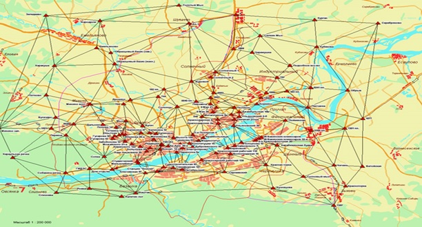{style="height:45vh; object-fit:contain;"}

:::

::: {.column width="60%"}

{style="height:45vh; object-fit:contain;"}

:::

::::

---


## Геодезические пункты

:::: {.columns}

::: {.column width="30%"}

- Сигналы
- Пирамиды
- Реперы
- Нивелирные марки
- ...

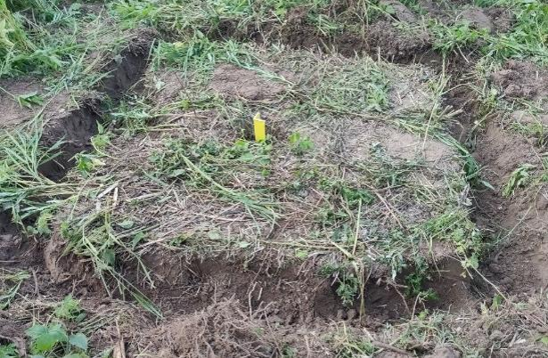{style="height:35vh; object-fit:contain;"}

:::

::: {.column width="30%"}

```{=html}
<div style="display:flex; flex-direction:column; align-items:center; gap:1.2rem; margin-top:0.5rem;">
  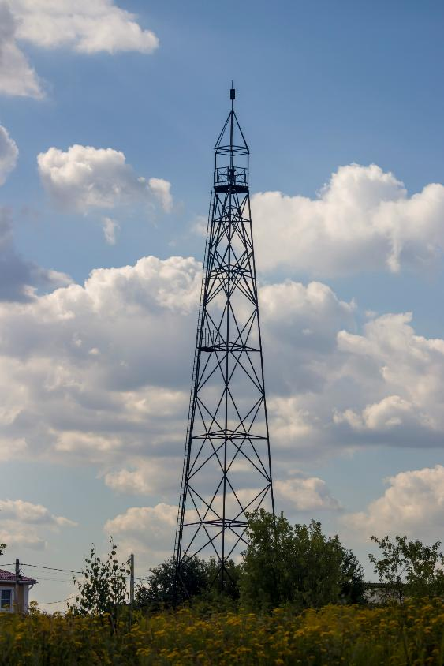
</div>
```

:::

::: {.column width="30%"}

```{=html}
<div style="display:flex; flex-direction:column; align-items:center; gap:1.2rem; margin-top:0.5rem;">
  
</div>
```

:::

::::

---

## Для чего нам координаты точек?

:::: {.columns}

::: {.column width="40%"}

- Создание планово-высотного обоснования (ПВО)

- Пикеты для создания плана/карты местности

- Профилирование

<div style="margin-top: 1.2rem; text-align: left;">
  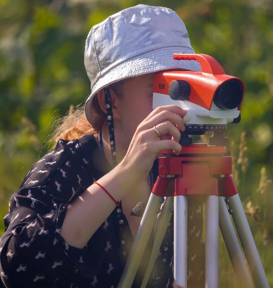
</div>

:::

::: {.column width="30%"}

```{=html}
<div style="display:flex; flex-direction:column; align-items:center; gap:1.2rem; margin-top:0.5rem;">
  
</div>
```

:::

::: {.column width="30%"}

```{=html}
<div style="display:flex; flex-direction:column; align-items:center; gap:1.2rem; margin-top:0.5rem;">
  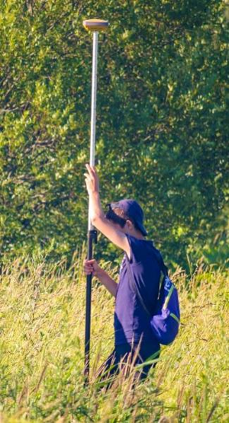
</div>
```

:::

::::

---

## Геодезические измерения

В геодезии и топографии в полевых условиях проводят измерения:

- Длин линий
- Углов (вертикальных и горизонтальных)
- Превышений
- Координат точек

В камеральных условиях происходят вычисления (обработка) полевых данных

:::: {.columns}

::: {.column width="50%}

{style="height:30vh; object-fit:contain;"}

:::

::: {.column width="50%}

{style="height:30vh; object-fit:contain;"}

:::

::::

---

## Погрешность измерений

– разность между результатом измерений и действительным значением измеряемой величины

- **Грубые** (ошибка исполнителя)
- **Систематические** (неисправность инструмента, влияние внешней среды, навыки исполнителя)
- **Случайные**

*Равноточными* измерениями считаются такие, при которых условия измерений постоянны

$$
a_{cp} = \frac{a_1 + a_2 + \cdots + a_n}{n} = \frac{\sum_{i=1}^{n} a_i}{n}
$$

---

## Невязка

– результат влияния погрешностей на точность измерений (расхождение теоретически вычисленных значений с измеренными)

:::: {.columns}

::: {.column width="40%"}

- Фактические
- Допустимые

Невязки бывают:

- Угловые
- Линейные
- Высотные

:::

::: {.column width="60%"}

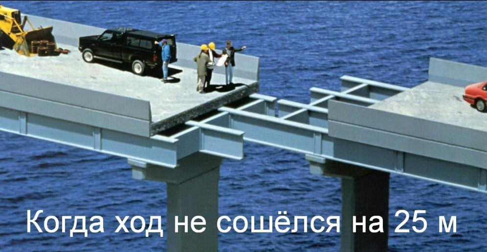

:::

::::

---

## Инструменты для измерения углов

```{=html}
<div style="display:flex; gap:1rem; margin-top:1rem;">
  <div style="width:32%;">
    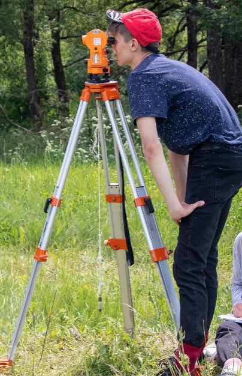
    Теодолит
  </div>
  <div style="width:32%;">
    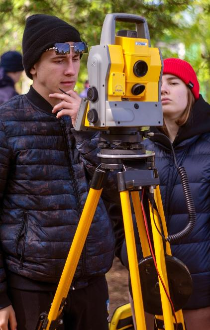
    Тахеометр
  </div>
  <div style="width:32%;">
    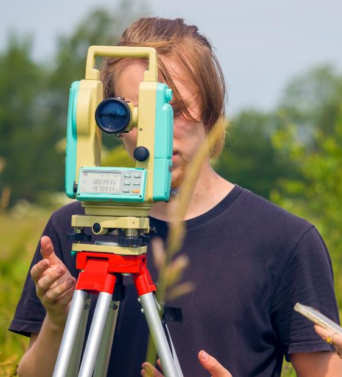
    Электронный теодолит
  </div>
</div>
```

---

## Инструменты для измерения длин линий

:::: {.columns}

::: {.column width="40%"}

- Рулетка
- Нитяной дальномер
- Лазерный дальномер

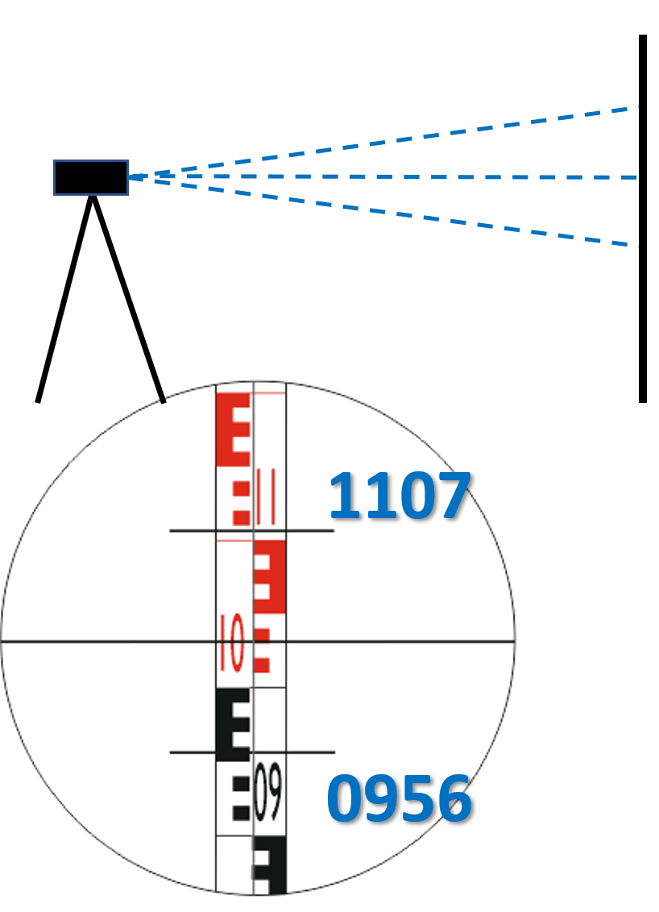{style="height:35vh; object-fit:contain;"}

𝑆=(1107−0956)∙100=151∙100(мм)=15,1 (м)

:::

::: {.column width="60%"}

{style="height:50vh; object-fit:contain;"}

:::

::::

---

## Триангуляция

– метод определения плановых координат на основе измерений внутренних углов треугольников

:::: {.columns}

::: {.column width="50%"}

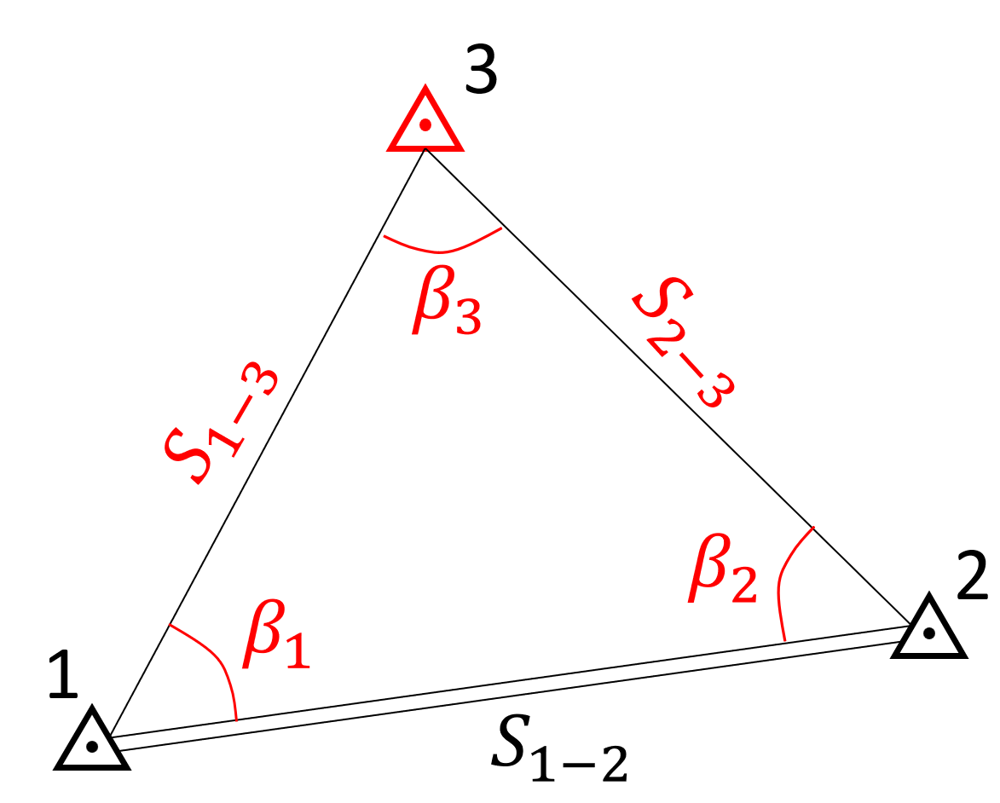

:::

::: {.column width="50%}

По теореме синусов:

$$
\frac{S_{1-2}}{\sin \color{red}\beta_{3}}
=
\frac{\color{red}{S_{2-3}}}{\sin \color{red}\beta_{1}}
=
\frac{\color{red}{S_{1-3}}}{\sin \color{red}\beta_{2}}
$$

:::

::::

---

## Геодезические засечки

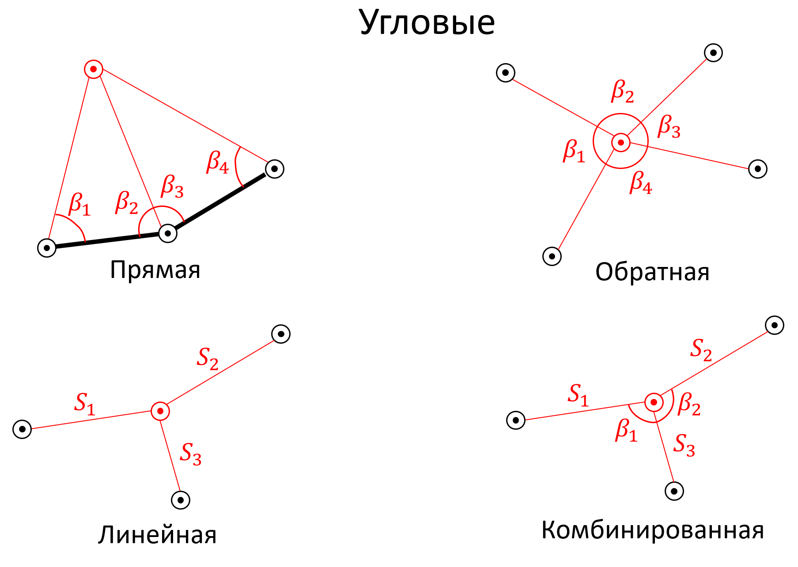

---

## Теодолитные ходы

ТХ бывают замкнутые и разомкнутые

Невязки ТХ подразделяются на угловые и линейные

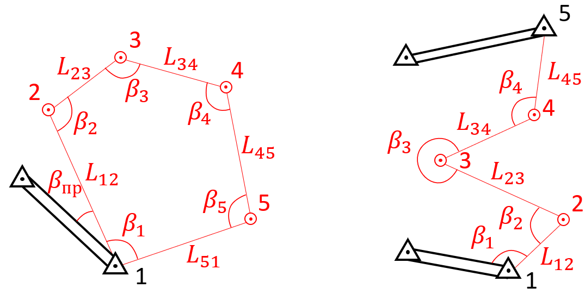

---

## Расчёт координат теодолитного хода (1)

0) Вычисление невязки горизонтальных углов для замкнутого n-угольника:

$$
f_\beta = \sum_{i=1}^{n} \beta_i - (n-2) \cdot 180^\circ
$$

1) Уравнивание горизонтальных углов $\beta_i$ (равномерно раскидывается): $\beta_i' = \beta_i + \frac{f_\beta}{n}$

2) Вычисление дирекционных углов сторон хода $\alpha_i$:

$$
\alpha_{1-2} = \alpha_{\text{тв}} + \beta_{пр};\qquad \alpha_{2-3} = \alpha_{1-2} + 180^\circ -  \beta_2; 
$$

3) Вычисление приращений координат $\Delta x_i$ и $\Delta y_i$:

$$
\Delta x_i = L_i \cos \alpha_i; \qquad  \Delta y_i = L_i \sin \alpha_i
$$

---

## Расчёт координат теодолитного хода (2)

4) Вычисление невязок по приращениям координат:

$$
f_x = \sum_{i=1}^{n} \Delta x_i; \qquad \qquad f_y = \sum_{i=1}^{n} \Delta y_i
$$

5) Уравнивание приращений координат $\Delta x_i$ и $\Delta y_i$:

$$
\Delta x_i' = \Delta x_i + f_x \frac{L_i}{\sum_{i=1}^{n} L_i}; \qquad \Delta y_i' = \Delta y_i + f_y \frac{L_i}{\sum_{i=1}^{n} L_i}
$$

6) Вычисление координат точек $x_i$ и $y_i$:

$$
x_i = x_{i-1} + \Delta x_i'; \qquad y_i = y_{i-1} + \Delta y_i'
$$

---

## Нивелирование

**Нивелирование** – *совокупность работ по определению высот местности*

**Тригонометрическое нивелирование** – определение высот на основе измерения вертикальных углов и расстояний

:::: {.columns}

::: {.column width="50%}

В случае нитяного дальномера:

$$
{\color{red} h_{BA} = 0,5S \sin 2\nu + i - U}
$$

или

$$
{\color{red} L = S\cos^2\nu}
$$

$$
{\color{red} h_{BA} = Ltg\nu + i - U}
$$

В случае лазерного дальномера:

$$
{\color{red} h_{BA} = S \sin\nu + i - U}
$$

:::

::: {.column width="50%}

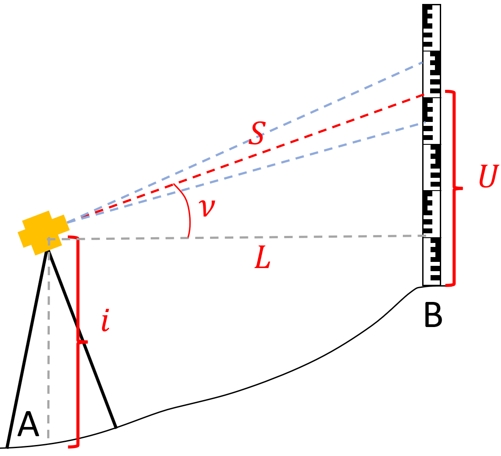{style="height:45vh; object-fit:contain;"}

:::

::::

---

## Геометрическое нивелирование

:::: {.columns}

::: {.column width="20%}

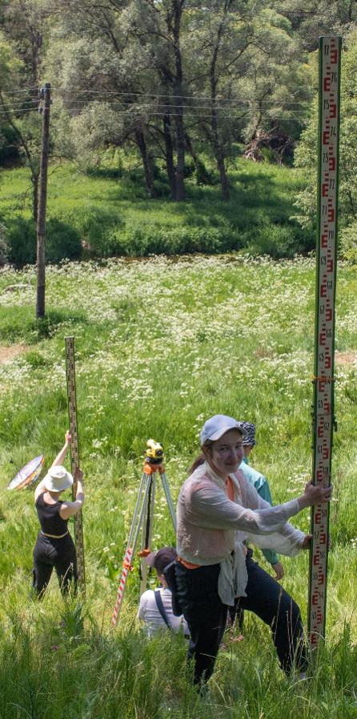{style="height:55vh; object-fit:contain;"}

:::

::: {.column width="80%}

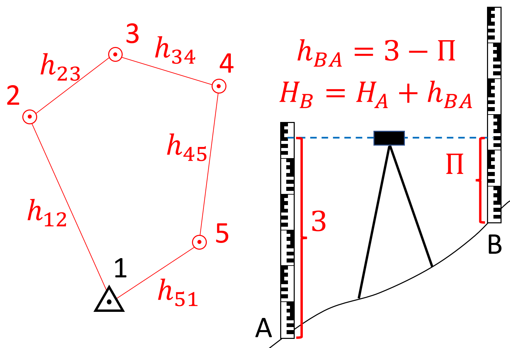{style="height:40vh; object-fit:contain;"}

Невязка замкнутого нивелирного хода: $f_h = \sum_{i=1}^{n} h_i$
:::

::::

---

## Уравнивание нивелирного хода

Допустимая невязка **геометрического нивелирования**

$$
f_{\text{доп }(\text{мм})} = \pm D_{(\text{мм})}\sqrt{L_{(\text{км})}}
$$

$L$ – длина хода, $D$ – коэффициент класса точности

**I класс:** $D = 3$ \qquad;
**II класс:** $D = 5$ \qquad;
**III класс:** $D = 10$ \qquad;
**IV класс:** $D = 20$

Допустимая невязка **тригонометрического нивелирования**

$$
f_{\text{доп }(\text{см})} = \pm 0,04\,S_{\text{ср }(\text{м})}\sqrt{n}
$$

$S_{\text{ср}}$ – средняя длина стороны, $n$ – число станций

*Уравнивание осуществляется пропорционально длинам сторон (плеч)*

$$
h_i' = h_i + f_h \frac{L_i}{\sum_{i=1}^{n} L_i}
$$

---

## Тахеометрическая съёмка (1)

:::: {.columns}

::: {.column width="25%}

- Производится для составления плана местности
- Пикеты (ПК) – точки, координаты которых необходимо определить
- Координаты пикетов имеют пониженную точность
- Выполняется теодолитом или тахеометром только при КЛ
- Необходимо две твёрдые точки для получения нулевого направления
- Измеряются: горизонтальный угол $\color{red}{\beta_{\text{ПК}}}$, расстояние $\color{red}{S_{\text{ПК}}}$, вертикальный угол $\color{red}{\nu_{\text{ПК}}}$ и высота визирования $(\color{red}{U_{\text{ПК}}})$

:::

::: {.column width="75%}

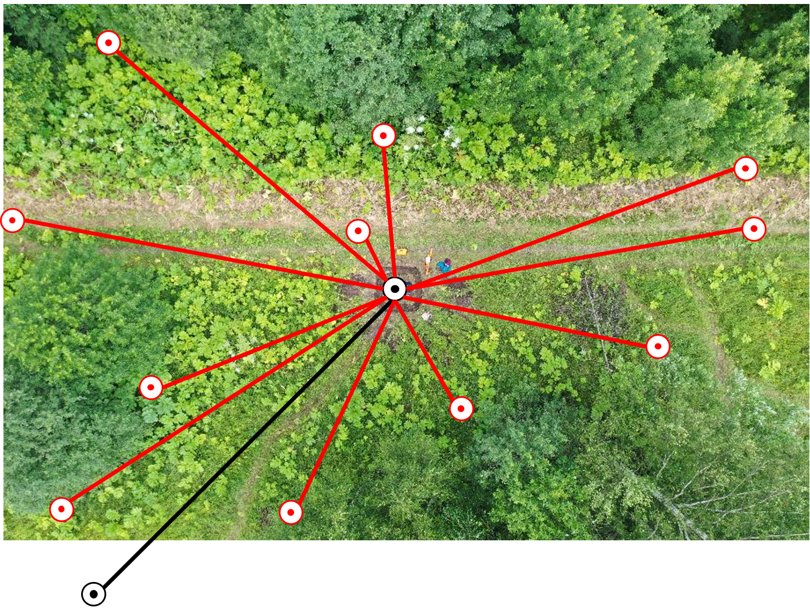{style="height:50vh; object-fit:contain;"}

:::

::::

---

## Тахеометрическая съёмка (2)

:::: {.columns}

::: {.column width="60%}

Для нахождения координат пикетов (ПК) используется прямая геодезическая задача

$$
\color{green}{\alpha_{\text{ПК}}} = \alpha_0 + 180^\circ + \color{red}{\beta_{\text{ПК}}}
$$

$$
L_{\text{ПК}} = \color{red}{S_{\text{ПК}}}\cos^2 \color{red}{\nu_{\text{ПК}}}
$$

$$
\begin{pmatrix}
\Delta x_{\text{ПК}} \\
\Delta y_{\text{ПК}}
\end{pmatrix}
=
\begin{pmatrix}
L_{\text{ПК}}\cos \color{green}{\alpha_{\text{ПК}}} \\
L_{\text{ПК}}\sin \color{green}{\alpha_{\text{ПК}}}
\end{pmatrix}
$$

$$
\begin{pmatrix}
x_{\text{ПК}} \\
y_{\text{ПК}}
\end{pmatrix}
=
\begin{pmatrix}
x_{\text{ст}} + \Delta x_{\text{ПК}} \\
y_{\text{ст}} + \Delta y_{\text{ПК}}
\end{pmatrix}
$$

$$
h_{\text{ПК}} =
0,5\,\color{red}{S_{\text{ПК}}}\sin(2\color{red}{\nu_{\text{ПК}}})
+ i - \color{red}{U_{\text{ПК}}}
$$

$$
H_{\text{ПК}} = H_{\text{ст}} + h_{\text{ПК}}
$$

:::

::: {.column width="40%}

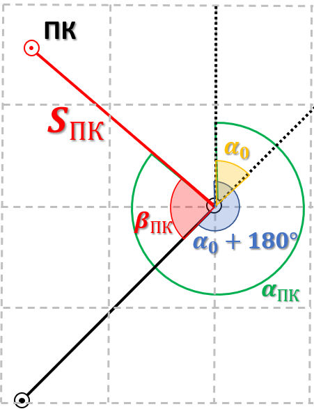{style="height:55vh; object-fit:contain;"}

:::

::::

---

## Глобальные навигационные спутниковые системы (ГНСС)

**Спутниковое позиционирование** – определение координат точки с помощью ГНСС

:::: {.columns}

::: {.column width="50%}

Глобальные системы

- GPS (США) – 32 спутника
- ГЛОНАСС (Россия) – 26 спутников
- Galileo (Европейский Союз) – 32 спутника
- Beidou (Китай) – 48 спутников

Региональные и уточняющие подсистемы

- IRNSS (Индия)
- QZSS (Япония)
- …

:::

::: {.column width="50%} 

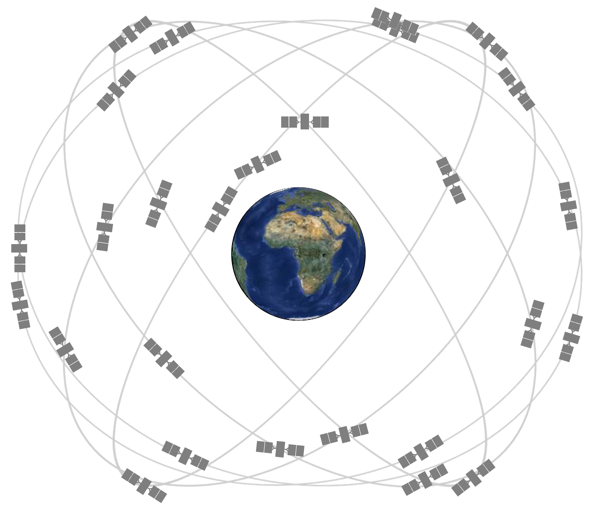{style="height:50vh; object-fit:contain;"}

:::

::::

---

## Принципы работы ГНСС

:::: {.columns}

::: {.column width="30%}

У спутников известны **эфемериды** – параметры орбиты

Все спутники, приёмники и наземные станции **синхронизированы** по атомным часам

Спутники непрерывно передают сигналы, содержащие информацию о времени передачи и эфемеридах

Беззапросный метод **линейной пространственной засечки** – измеряются дальности до 3 и более спутников

:::

::: {.column width="70%}

<iframe src="https://www.geogebra.org/3d/cayxeud3?embed" width="800" height="600" allowfullscreen style="border: 1px solid #e4e4e4;border-radius: 4px;" frameborder="0"></iframe>

:::

::::

---

## Кодовый метод измерения дальности до спутника

Одинаковый сигнал, представляющий собой псевдослучайную последовательность 0 и 1, генерируется на спутнике и приёмнике

Сигнал синхронизирован, но за время прохождения от спутника до приёмника происходит смещение сигнала

:::: {.columns}

::: {.column width="10%"}

$\color{blue}{Спутник}$

$\color{red}{Приёмник}$


:::

::: {.column width="90%"}

```{=html}
<style>
.rx-signal{
  animation: signalShift 8s ease-in-out infinite alternate;
}

@keyframes signalShift{
  from { transform: translateX(0px); }
  to   { transform: translateX(500px); }
}

.signal-svg{
  margin-left:0;
  display:block;
}
</style>

<svg class="signal-svg" viewBox="0 0 1100 300" width="100%">

<!-- синий сигнал -->
<polyline points="
260,40 330,40 330,120 365,120 365,40 400,40 400,120
480,120 480,40 570,40 570,120 610,120 610,40
630,40 630,120 680,120 680,40 820,40 820,120
960,120 960,40 980,40 980,120 1015,120 1015,40"
fill="none" stroke="#4f76c7" stroke-width="4"/>

<!-- красный сигнал -->
<g class="rx-signal">
<polyline points="
260,40 330,40 330,120 365,120 365,40 400,40 400,120
480,120 480,40 570,40 570,120 610,120 610,40
630,40 630,120 680,120 680,40 820,40 820,120
960,120 960,40 980,40 980,120 1015,120 1015,40"
fill="none" stroke="red" stroke-width="4"/>
</g>

<!-- скобка -->
<path d="M260 235 Q260 250 270 250 L540 250
Q550 250 550 265 Q550 250 560 250
L740 250 Q750 250 750 235"
fill="none" stroke="black" stroke-width="1.5"/>

<text x="550" y="295" text-anchor="middle" font-size="30">Δt</text>

</svg>
```

:::

::::

$$
s = c\left(t_{\text{приёма}} - t_{\text{начала}}\right) = c\Delta t
$$

---

## Фазовый метод измерения дальности до спутника

Длина волны $\lambda$ – расстояние, на которое распространяется волна за один период колебаний

В ГНСС используется длина волны $L_1$ (около 19 см) и $L_2$ (около 24 см)

Рассчитывается количество целых длин волн $N$, прошедших от спутника до приёмника, и дробная часть волны (фаза $\varphi$)

```{=html}
<svg viewBox="0 0 900 180" width="70%">

<!-- фон -->
<rect x="0" y="0" width="900" height="120"
fill="#8fa8cf" opacity="0.9"/>

<!-- первая часть -->
<rect x="0" y="0" width="90" height="120"
fill="#e6d5c5"/>

<!-- синус -->
<path d="
M0 60
Q30 0 60 60
T120 60
T180 60
T240 60
T300 60
T360 60
T420 60
T480 60
T540 60
T600 60
T660 60
T720 60
T780 60
T840 60
T900 60"
fill="none" stroke="black" stroke-width="4"/>

</svg>
```

$$
s = N{\color{#88A6E8}\lambda} + {\color{#E7A06B}\varphi}
$$

---

## Факторы погрешностей измерений

:::: {.columns}

::: {.column width="50%}

**Влияет:**

- Ионосфера
- Тропосфера
- Физические препятствия
- Многолучевость
- Геометрический фактор
- Несинхронность часов

:::

::: {.column width="50%}

**Повышает точность:**

- Увеличение времени позиционирования
- Использование нескольких спутниковых систем
- Использование многочастотных приёмников
- Планирование наблюдений с учётом созвездий спутников
- Одновременное наблюдение несколькими приёмниками

:::

::::

---

## Дифференциальное позиционирование

:::: {.columns}

::: {.column width="50%}

- Используется одновременно, как минимум, два приёмника

- На базовой станции рассчитываются дифференциальные поправки

- Дифференциальные поправки добавляются к координатам на ровере

- Работа в режиме **статики** и **кинематики** (RTK)

\vspace{0.4em}

$$
\begin{pmatrix}
\Delta x \\
\Delta y \\
\Delta z
\end{pmatrix}
=
\begin{pmatrix}
x_{\text{базы}} \\
y_{\text{базы}} \\
z_{\text{базы}}
\end{pmatrix}
-
\begin{pmatrix}
x_{\text{изм}} \\
y_{\text{изм}} \\
z_{\text{изм}}
\end{pmatrix}
$$

$$
\begin{pmatrix}
x_{\text{ровера}} \\
y_{\text{ровера}} \\
z_{\text{ровера}}
\end{pmatrix}
=
\begin{pmatrix}
x_{\text{изм}} \\
y_{\text{изм}} \\
z_{\text{изм}}
\end{pmatrix}
+
\begin{pmatrix}
\Delta x \\
\Delta y \\
\Delta z
\end{pmatrix}
$$

:::

::: {.column width="50%}

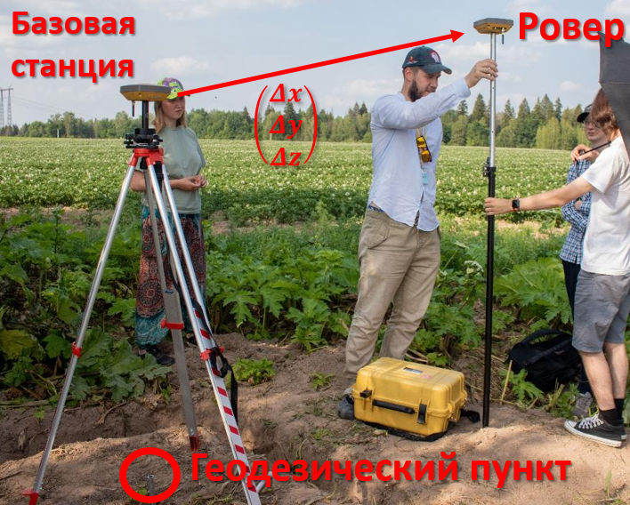{style="height:60vh; object-fit:contain;"}

:::

::::

---

## Способы позиционирования

Точность определения плановых координат

|               | **Автономный** | **Дифференциальный** |
|---------------|----------------|----------------------|
| Кодовый       | 5-15 м         | 1-3 м                |
| Фазовый       | 0,5-3 м        | 0,001-0,03 м         |

:::: {.columns}

::: {.column width="23%"}
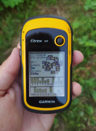{fig-alt="GPS-навигатор" style="width:100%; height:400px; object-fit:cover;"}
:::

::: {.column width="17%"}
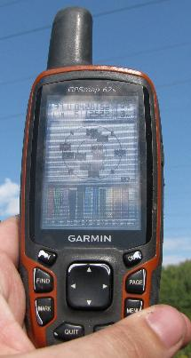{fig-alt="Портативный GPS-приёмник" style="width:100%; height:400px; object-fit:cover;"}
:::

::: {.column width="27%"}
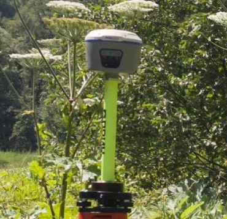{fig-alt="GNSS-приёмник на вехе" style="width:100%; height:400px; object-fit:cover;"}
:::

::: {.column width="33%"}
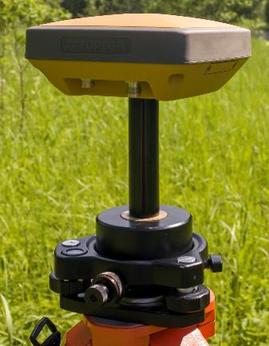{fig-alt="Геодезический GNSS-приёмник" style="width:80%; height:400px; object-fit:cover;"}
:::

::::
---

## Сюрприз № 4

<https://forms.gle/yz2bRLN7ZQi4MBa66>

{style="height:55vh; object-fit:contain;"}