## Дистанционное зондирование Земли (ДЗЗ)

– изучение поверхности и недр Земли путём наблюдения и измерения собственного и/или отражённого излучения географических объектов

Данные дистанционного зондирования (ДДЗ) позволяют извлекать:

- Геометрическую (позиционную) составляющую объектов – контуры, высоты, перемещение
- Свойства объектов и явлений (семантика)
  - Качественные
  - Количественные

---

## Высота съёмки

:::: {.columns}

::: {.column width="30%"}

- Космические изображения
  - Орбитальные станции
  - Ресурсные спутники
  - Метеорологические спутники
  - Геостационарные спутники
- Аэроснимки
  - БПЛА
  - Пилотируемая авиация
- Наземная съёмка
  - Спектрометрирование

:::

::: {.column width="70%"}

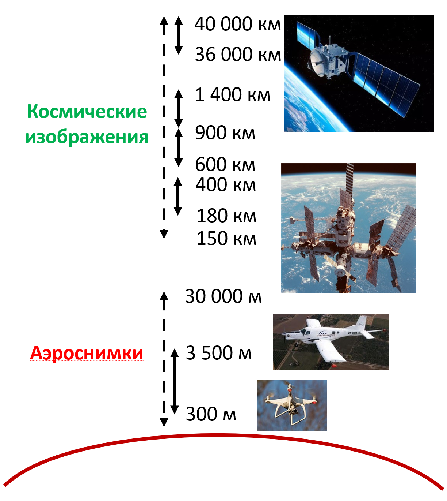{style="height:45vh; object-fit:contain;"}

:::

::::

---

## Спектр электромагнитных колебаний

:::: {.columns}

::: {.column width="50%"}

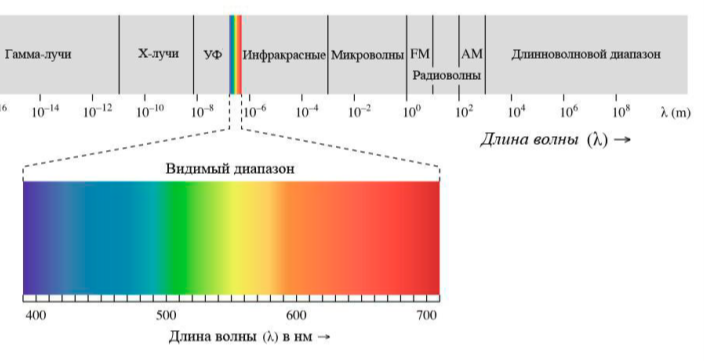{style="height:30vh; object-fit:contain;"}

- Тепловое излучение
  - 8,0 – 9,5 мкм	Тепловой инфракрасный I (TIR 1)
  - 10 – 14 мкм	Тепловой инфракрасный II (TIR 2)

:::

::: {.column width="50%"}

- Отражённое солнечное излучение
  - 0,4 – 0,7 мкм	Видимый диапазон (Visible)
  - 0,7 – 1,3 мкм 	Ближний инфракрасный диапазон (NIR)
  - 1,4 – 1,8 мкм	Коротковолновый I (SWIR 1)
  - 2,0 – 2,5 мкм	Коротковолновый II (SWIR 2)
- Незначительное отражённое и собственное тепловое излучение
  - 3,0 – 4,0 мкм	Средний инфракрасный I 
  - 4,5 – 5,0 мкм	Средний инфракрасный II

:::

::::

---

## Виды съёмок

:::: {.columns}

::: {.column width="40%}

- Пассивные
  - Фотографическая
  - Сканерная
- Активная
  - Радиолокация
  - Лидарная
  - Эхолотирование

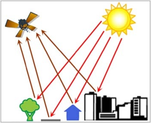{style="height:15vh; object-fit:contain;"}

:::

::: {.column width="60%}

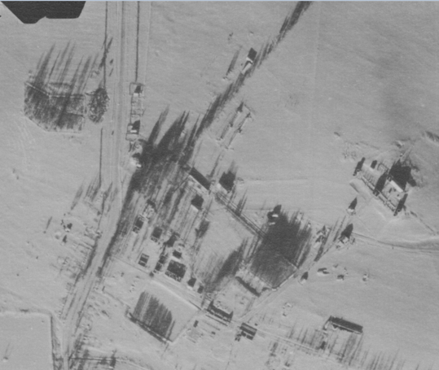{style="height:50vh; object-fit:contain;"}

:::

::::

---

## Пространственное разрешение (пространственная детализация)

:::: {.columns}

::: {.column width="40%}

– размер на местности минимального объекта, хорошо различимого на изображении

| **Разрешение**| **Размер пиксела** |
|---------------|---------------------|
| Низкое        | Километры           |
| Среднее       | Сотни метров        |
| Высокое       | Десятки метров      |
| Очень высокое | Метры               |
| Сверхвысокое  | Десятки сантиметров |

:::

::: {.column width="60%}

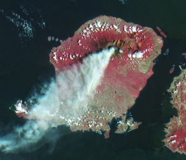{style="height:20vh; object-fit:contain;"}

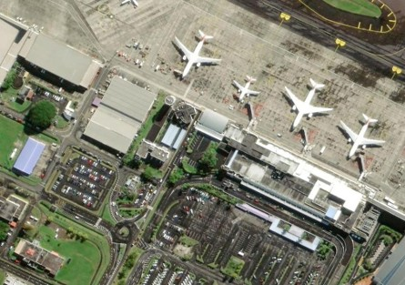{style="height:20vh; object-fit:contain;"}

:::

::::

---

## Пространственное разрешение

:::: {.columns}

::: {.column width="50%"}

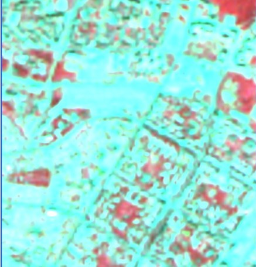{style="height:40vh; object-fit:contain;"}

Пространственное разрешение – 23 метра
:::

::: {.column width="50%"}

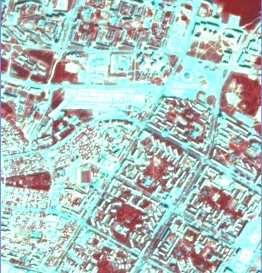{style="height:40vh; object-fit:contain;"}

Пространственное разрешение – 6 метров 

:::

::::

---

## Спектральное разрешение

- Чем у́же спектральный диапазон съёмки, тем выше спектральное разрешение
- Панхроматический диапазон охватывает широкий спектр оптического излучения (0,45 – 0,90 мкм)
- Чем выше спектральное разрешение, тем ниже пространственное разрешение

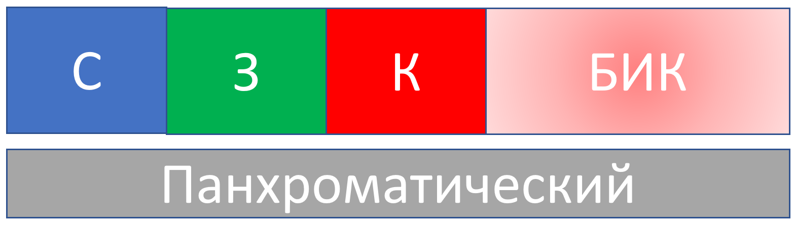{style="height:25vh; object-fit:contain;"}

---

## Спектральные каналы

:::: {.columns}

::: {.column width="50%"}

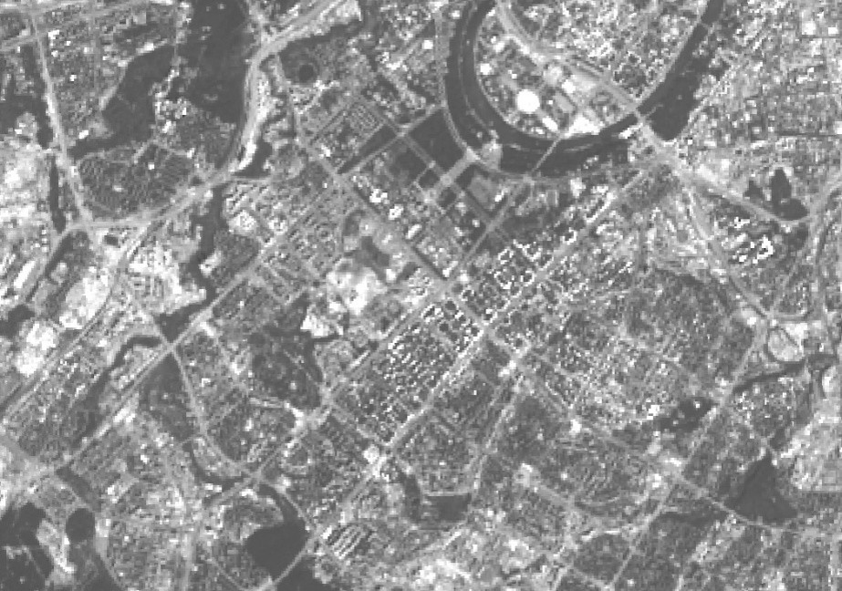{style="height:25vh; object-fit:contain;"} [Синий]{style="color: blue;"}

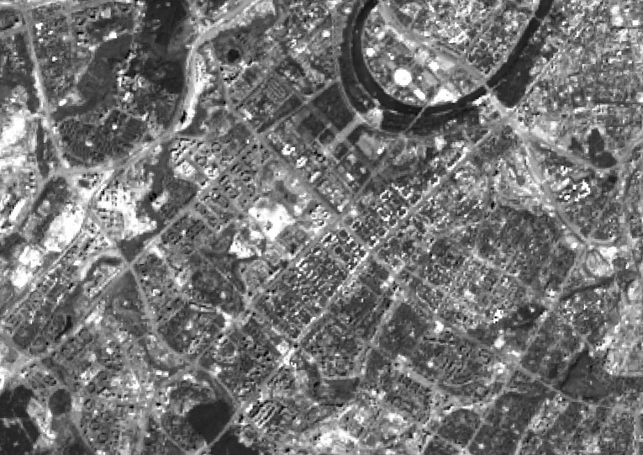{style="height:25vh; object-fit:contain;"} [Зелёный]{style="color: green;"}

:::

::: {.column width="50%"}

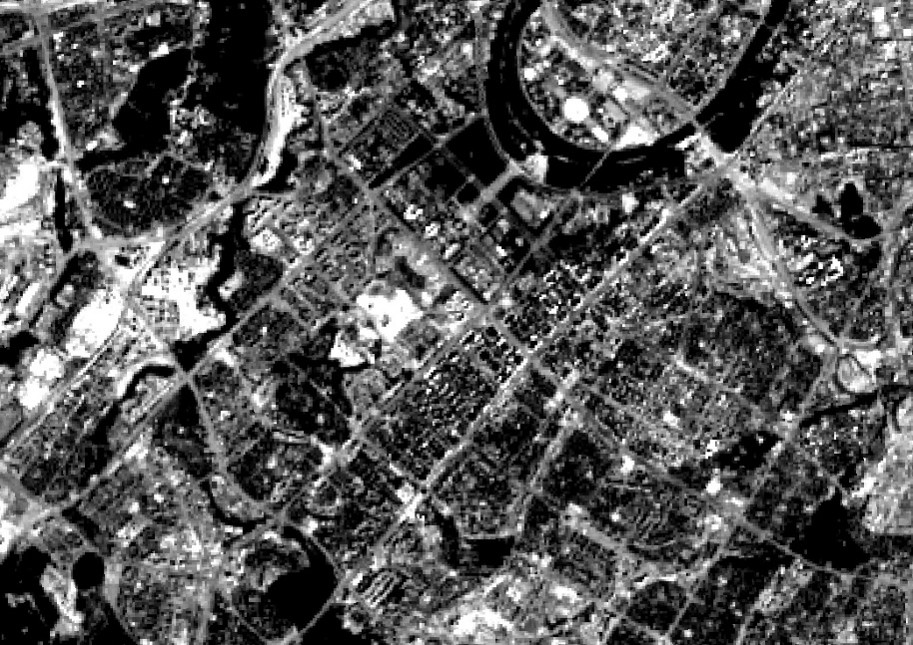{style="height:25vh; object-fit:contain;"} [Красный]{style="color: red;"}

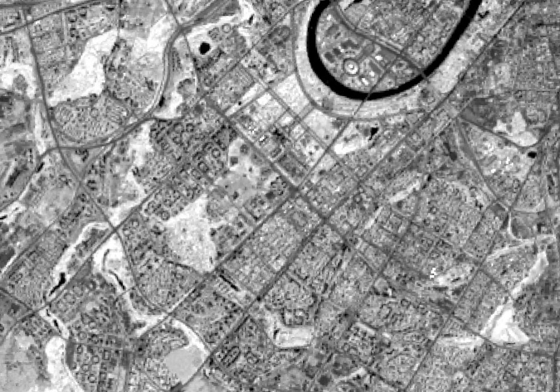{style="height:25vh; object-fit:contain;"} БИК

:::

::::

---

## Синтезирование изображений

:::: {.columns}

::: {.column width="50%"}

[**Red**]{style="color: red;"}

[**Green**]{style="color: green;"}

[**Blue**]{style="color: blue;"}

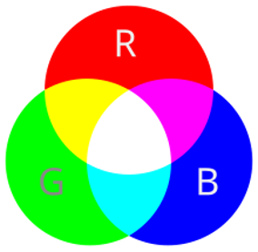{style="height:25vh; object-fit:contain;"}

:::

::: {.column width="50%}

 1 Visible (0,43 – 0,45 мкм)

 2 Visible (0,450 – 0,51 мкм)

 3 Visible (0,53 – 0,59 мкм)

 4 Red (0,64 – 0,67 мкм)

 5 Near-Infrared (0,85 – 0,88 мкм)

 6 SWIR 1 (1,57 – 1,65 мкм)

 7 SWIR 2 (2,11 – 2,29 мкм)

:::

::::

---

## Панхроматический канал и синтез спектральных каналов

:::: {.columns}

::: {.column width="50%"}

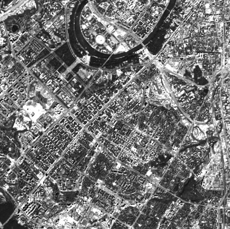{style="height:50vh; object-fit:contain;"}

:::

::: {.column width="50%}

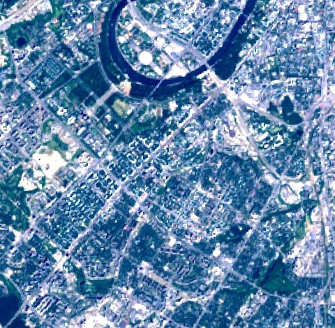{style="height:50vh; object-fit:contain;"}

:::

::::

---

## Варианты синтеза (Landsat 8)

:::: {.columns}

::: {.column width="50%"}

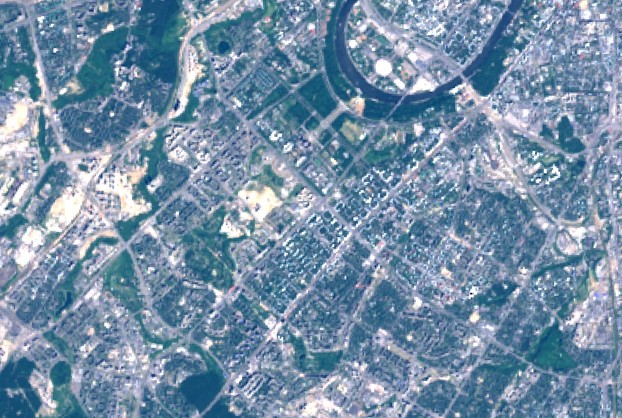{style="height:40vh; object-fit:contain;"}

4-3-2 (красный, зелёный, синий) – натуральная цветопередача

:::

::: {.column width="50%}

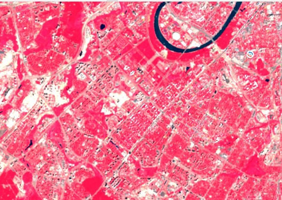{style="height:40vh; object-fit:contain;"}

5-4-3 (красный, зелёный, синий) – псевдонатуральные цвета

:::

::::

---

## Варианты синтеза (Landsat 8)

:::: {.columns}

::: {.column width="50%"}

{style="height:40vh; object-fit:contain;"}

4-3-2 (красный, зелёный, синий) – натуральная цветопередача

:::

::: {.column width="50%}

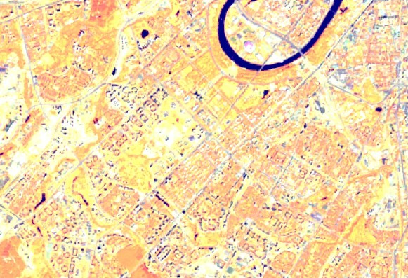{style="height:40vh; object-fit:contain;"}

5-6-2 (красный, ближний инфракрасный, синий) – состояние растительности

:::

::::

---

## Дешифрирование ДЗЗ

– распознавание и отрисовка в условных знаках объектов и явлений по ДДЗ

- Полевое
  - Наземное
  - Аэровизуальное
- Камеральное

**Схема дешифрирования** – графическое изображение распознанных объектов в условных знаках

Дешифрирование осуществляется на основе **дешифровочных признаков**

---

## Дешифровочные признаки (1)

**Прямые** – признаки самих объектов

**Косвенные** – прямой признак объекта-индикатора

:::: {.columns}

::: {.column width="50%}

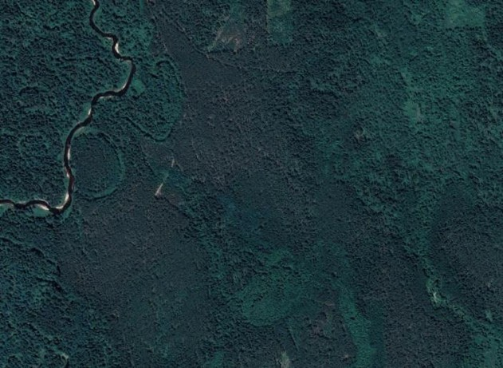{style="height:50vh; object-fit:contain;"}

:::

::: {.column width="50%}

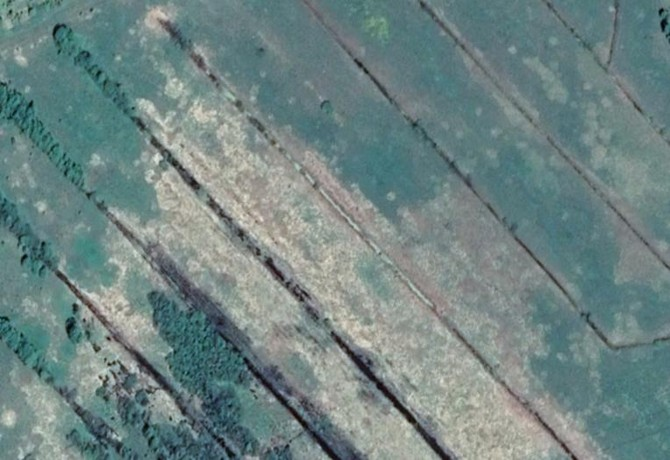{style="height:50vh; object-fit:contain;"}

:::

::::

---

## Дешифровочные признаки (2)

:::: {.columns}

::: {.column width="20%}

- Геометрические
  - **Форма**
  - Размер
  - Тени
- Яркостные
  - Яркость
  - Цвет
  - Спектральный образ
- Структурные
  - Текстура
  - Структура
  - Рисунок

:::

::: {.column width="80%}

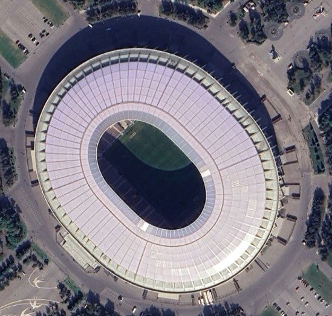{style="height:50vh; object-fit:contain;"}

:::

::::

---

## Дешифровочные признаки (3)

:::: {.columns}

::: {.column width="20%}

- Геометрические
  - **Форма**
  - Размер
  - Тени
- Яркостные
  - Яркость
  - Цвет
  - Спектральный образ
- Структурные
  - Текстура
  - Структура
  - Рисунок

:::

::: {.column width="80%}

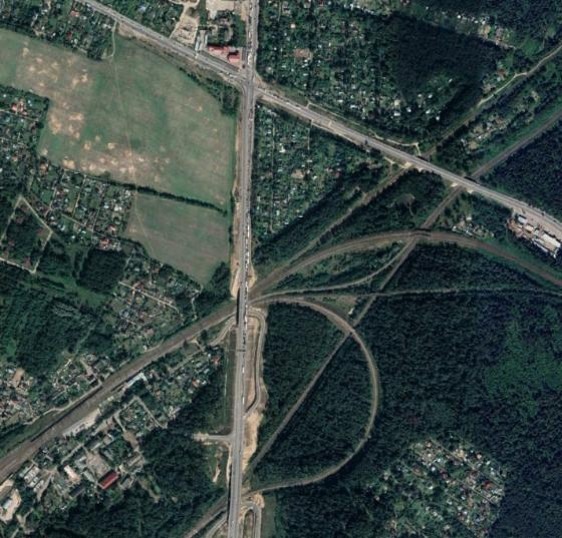{style="height:50vh; object-fit:contain;"}

:::

::::

---

## Дешифровочные признаки (4)

:::: {.columns}

::: {.column width="20%}

- Геометрические
  - **Форма**
  - Размер
  - Тени
- Яркостные
  - Яркость
  - Цвет
  - Спектральный образ
- Структурные
  - Текстура
  - Структура
  - Рисунок

:::

::: {.column width="80%}

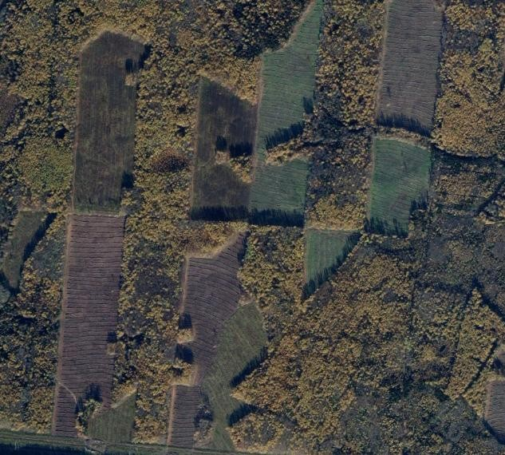{style="height:50vh; object-fit:contain;"}

:::

::::

---

## Дешифровочные признаки (5)

:::: {.columns}

::: {.column width="20%}

- Геометрические
  - Форма
  - **Размер**
  - Тени
- Яркостные
  - Яркость
  - Цвет
  - Спектральный образ
- Структурные
  - Текстура
  - Структура
  - Рисунок

:::

::: {.column width="80%}

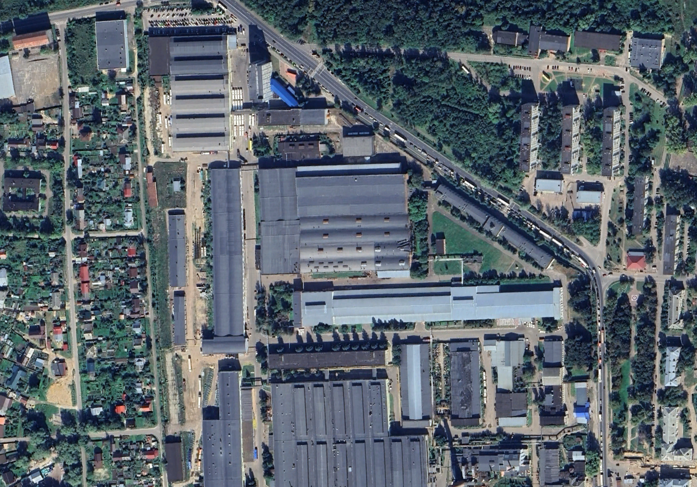{style="height:50vh; object-fit:contain;"}

:::

::::

---

## Дешифровочные признаки (6)

:::: {.columns}

::: {.column width="20%}

- Геометрические
  - Форма
  - Размер
  - **Тени**
- Яркостные
  - Яркость
  - Цвет
  - Спектральный образ
- Структурные
  - Текстура
  - Структура
  - Рисунок

:::

::: {.column width="80%}

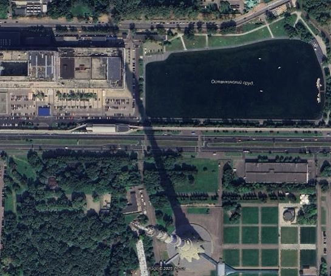{style="height:50vh; object-fit:contain;"}

:::

::::

---

## Дешифровочные признаки (7)

:::: {.columns}

::: {.column width="20%}

- Геометрические
  - Форма
  - Размер
  - **Тени**
- Яркостные
  - Яркость
  - Цвет
  - Спектральный образ
- Структурные
  - Текстура
  - Структура
  - Рисунок

:::

::: {.column width="80%}

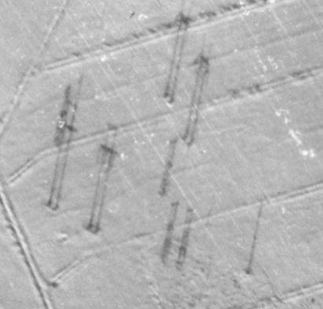{style="height:50vh; object-fit:contain;"}

:::

::::

---

## Дешифровочные признаки (8)

:::: {.columns}

::: {.column width="20%}

- Геометрические
  - Форма
  - Размер
  - Тени
- Яркостные
  - **Яркость**
  - Цвет
  - Спектральный образ
- Структурные
  - Текстура
  - Структура
  - Рисунок

:::

::: {.column width="80%}

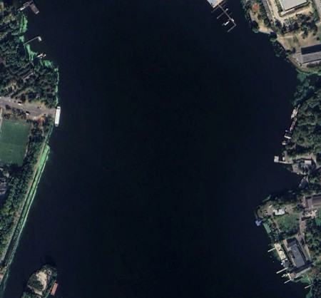{style="height:50vh; object-fit:contain;"}

:::

::::

---

## Дешифровочные признаки (9)

:::: {.columns}

::: {.column width="20%}

- Геометрические
  - Форма
  - Размер
  - Тени
- Яркостные
  - **Яркость**
  - Цвет
  - Спектральный образ
- Структурные
  - Текстура
  - Структура
  - Рисунок

:::

::: {.column width="80%}

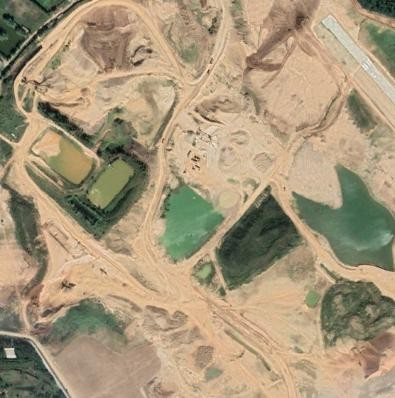{style="height:50vh; object-fit:contain;"}

:::

::::

---

## Дешифровочные признаки (10)

:::: {.columns}

::: {.column width="20%}

- Геометрические
  - Форма
  - Размер
  - Тени
- Яркостные
  - Яркость
  - **Цвет**
  - Спектральный образ
- Структурные
  - Текстура
  - Структура
  - Рисунок

:::

::: {.column width="80%}

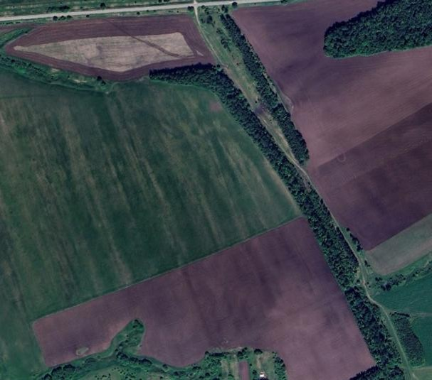{style="height:50vh; object-fit:contain;"}

:::

::::

---

## Дешифровочные признаки (11)

:::: {.columns}

::: {.column width="20%}

- Геометрические
  - Форма
  - Размер
  - Тени
- Яркостные
  - Яркость
  - Цвет
  - Спектральный образ
- Структурные
  - **Текстура**
  - **Структура**
  - Рисунок

:::

::: {.column width="80%}

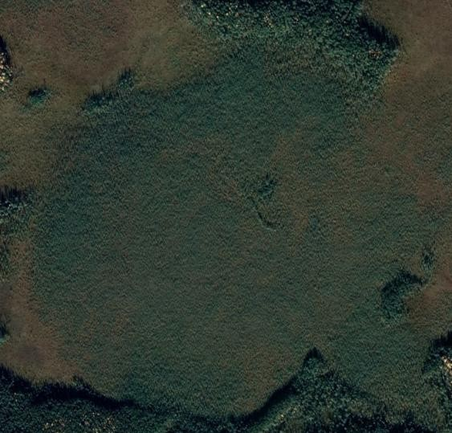{style="height:50vh; object-fit:contain;"}

:::

::::

---

## Дешифровочные признаки (12)

:::: {.columns}

::: {.column width="20%}

- Геометрические
  - Форма
  - Размер
  - Тени
- Яркостные
  - Яркость
  - Цвет
  - Спектральный образ
- Структурные
  - **Текстура**
  - **Структура**
  - Рисунок

:::

::: {.column width="80%}

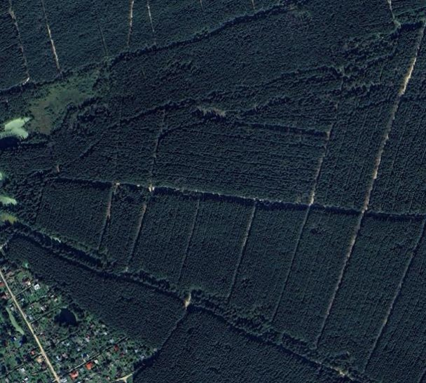{style="height:50vh; object-fit:contain;"}

:::

::::

---

## Дешифровочные признаки (13)

:::: {.columns}

::: {.column width="20%}

- Геометрические
  - Форма
  - Размер
  - Тени
- Яркостные
  - Яркость
  - Цвет
  - Спектральный образ
- Структурные
  - Текстура
  - Структура
  - **Рисунок**

:::

::: {.column width="80%}

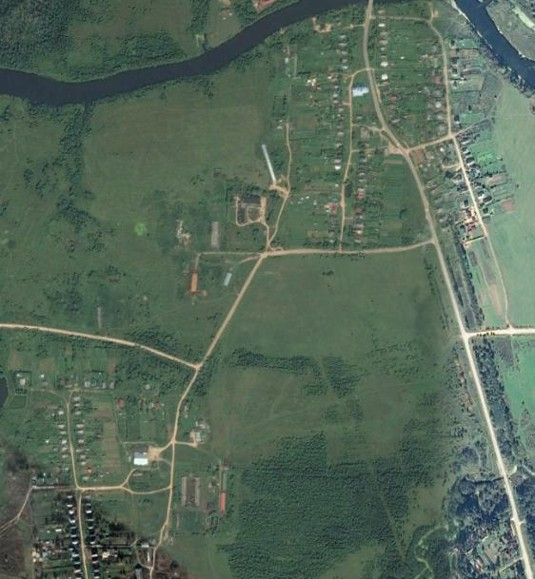{style="height:50vh; object-fit:contain;"}

:::

::::

---

## Дешифровочные признаки (14)

:::: {.columns}

::: {.column width="20%}

- Геометрические
  - Форма
  - Размер
  - Тени
- Яркостные
  - Яркость
  - Цвет
  - Спектральный образ
- Структурные
  - Текстура
  - Структура
  - **Рисунок**

:::

::: {.column width="80%}

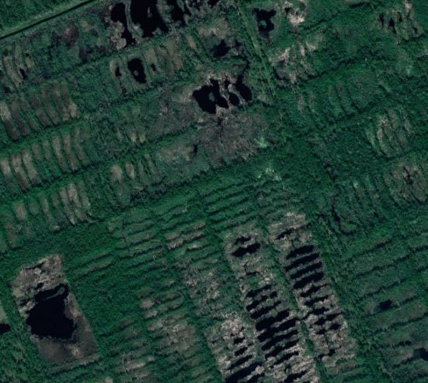{style="height:50vh; object-fit:contain;"}

:::

::::

---

## Индексные изображения

**Индексные изображения** – это результат преобразования многозонального снимка на основе арифметических операций со значениями яркостей в исходных спектральных зонах

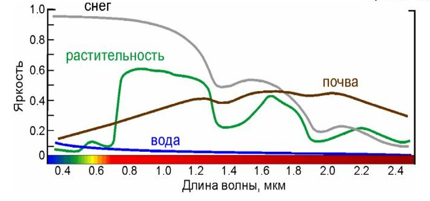{style="height:50vh; object-fit:contain;"}

---

## Вегетационный индекс NDVI

:::: {.columns}

::: {.column width="80%}

$$
\text{NDVI} = \frac{NIR - Red}{NIR + Red}
$$

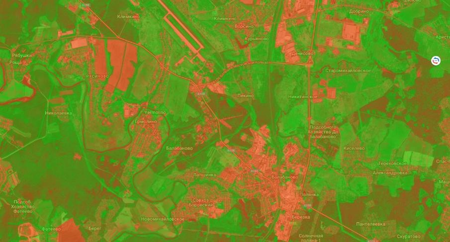{style="height:50vh; object-fit:contain;"}

:::

::: {.column width="20%}

NDVI Изменяется от -1 до +1

| **Объект**           |**NDVI**|
|----------------------|--------|
| Густая растительность| 0,7    |
| Редкая растительность| 0,5    |
| Вода                 | -0,3   |
| Асфальт              | -0,5   |
| Открытая почва       | 0,1    |

:::

::::

---

## Геометрия кадрового снимка

:::: {.columns}

::: {.column width="80%}

Благодаря геометрической модели камеры, которая описывает процесс формирования изображения, можно восстановить пространственные координаты объектов на местности

**Элементы внутреннего ориентирования:**

- Координаты главной точки $\color{#FF0000}{c} (x, y)$
- Фокусное расстояние $\color{#FFC000}{𝑓}$

**Элементы внешнего ориентирования:**

- Три координаты точки центра проекции $\color{#00B050}{O} (X, Y, Z)$
- Три угла поворота камеры $\color{#00B0F0}{\omega}, \color{#00B0F0}{\alpha}, \color{#00B0F0}{\kappa}$

:::

::: {.column width="20%}

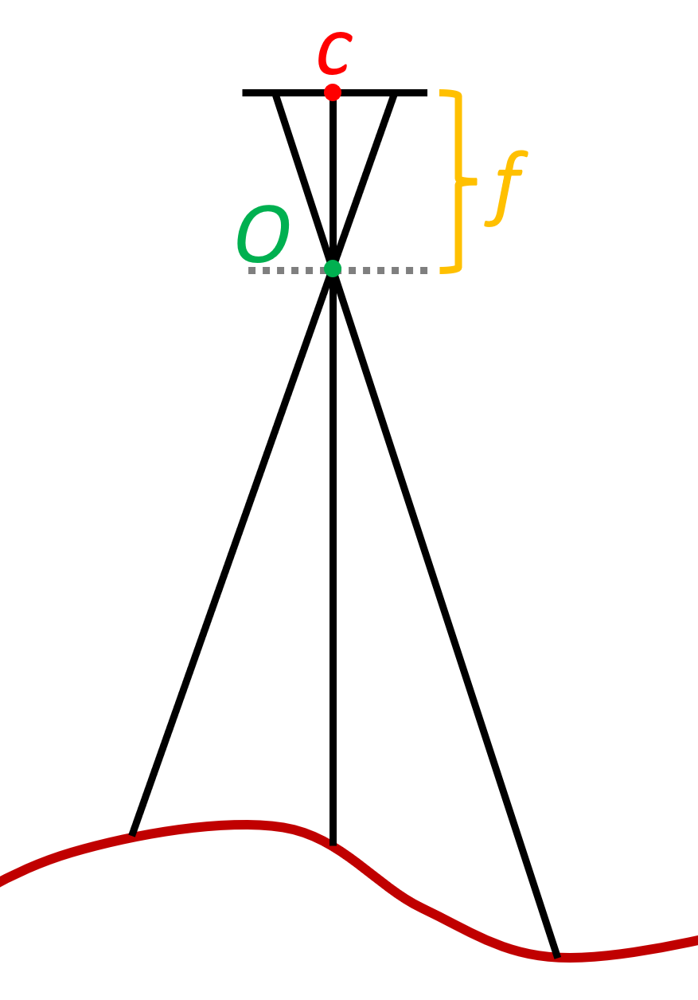{style="height:50vh; object-fit:contain;"}

:::

::::

---

## Расчёт превышения по стереопаре

:::: {.columns}

::: {.column width="50%}

$H_{абс}$ – высота полёта над уровенной поверхностью

$H_{ср}$ – средняя высота местности над уровенной поверхностью

$p$ – параллакс, разность соответственных координат одного и того же объекта на двух снимках

$$
H = H_{абс} - \frac{H_{max} - H_{min}}{2}
$$

$$
p = x_{л} - x_{пр}
$$

$$
\Delta p = \color{green}p_a - \color{red}p_b
$$

$$
h = H \frac{\Delta p}{b}
$$

:::

::: {.column width="50%} 

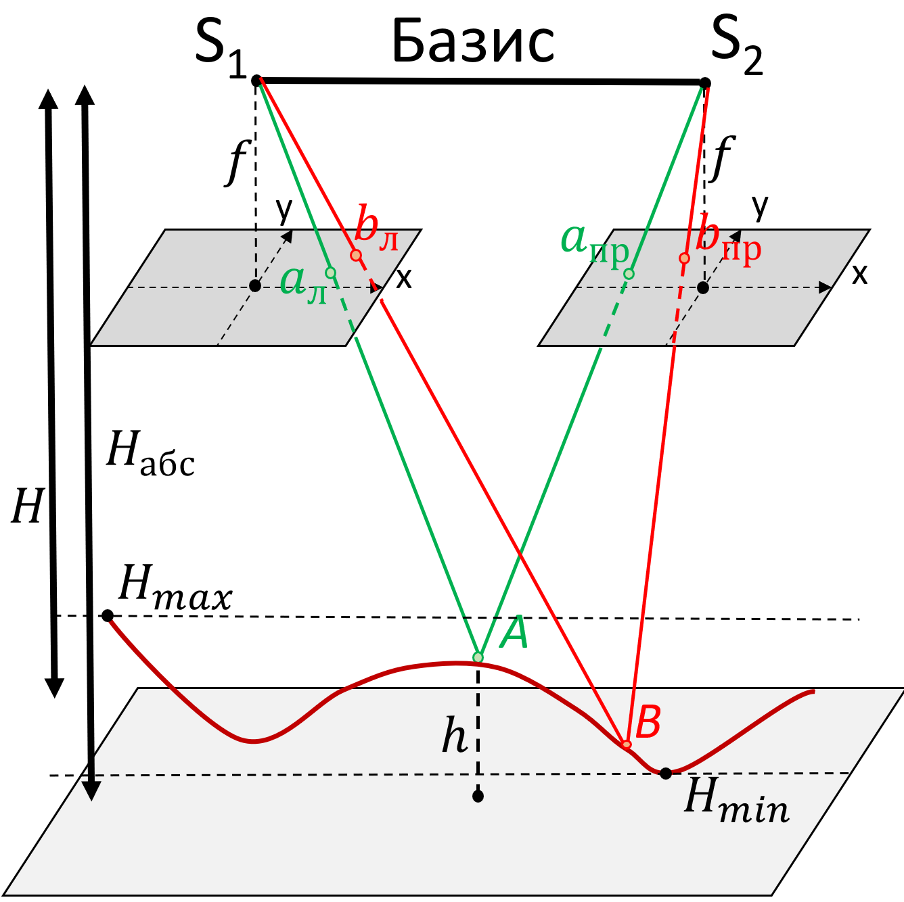{style="height:50vh; object-fit:contain;"}

:::

::::

---

## Аэрофотосъёмка с БПЛА

Снимаемая территория охватывается галсами залёта

Необходимо поперечное (60%) и продольное (80%) перекрытие кадров

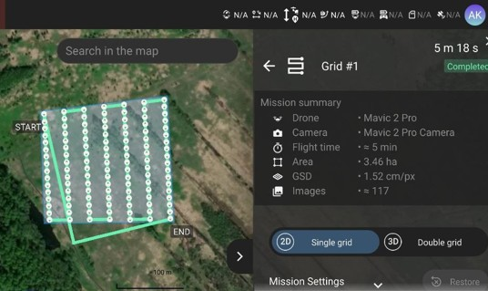{style="height:40vh; object-fit:contain;"}

---

## Фотограмметрическая обработка (1)

:::: {.columns}

::: {.column width="50%"}

1) Взаимное ориентирование снимков и создание разреженного облака точек

2) Расстановка опорных точек

3) Создание плотного облака точек

4) Создание цифровой модели поверхности

5) Создание фотомозаики и ортофотоплана

:::

::: {.column width="50%"}

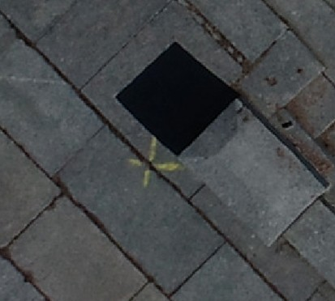{style="height:40vh; object-fit:contain;"}

:::

::::

---

## Фотограмметрическая обработка (2)

:::: {.columns}

::: {.column width="50%}

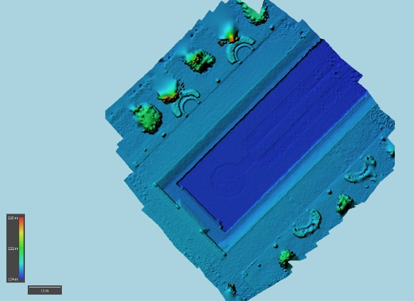{style="height:40vh; object-fit:contain;"}

Цифровая модель поверхности

:::

::: {.column width="50%}

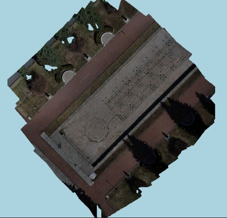{style="height:40vh; object-fit:contain;"}

Фотомозаика

:::

::::

---

## Сюрприз № 5

<https://forms.gle/e7mkMz1V47Eeh6Du6>

{style="height:55vh; object-fit:contain;"}