## Пространственные данные

– данные, которые описывают объекты и явления в пространстве, а также их взаимное расположение и взаимодействие

Явления и объекты, описываемые пространственными данными, могут быть:

- Дискретными (например, здания, дороги, реки)
- Непрерывными (например, рельеф, температура, влажность)

:::: {.columns}

::: {.column width="50%"}

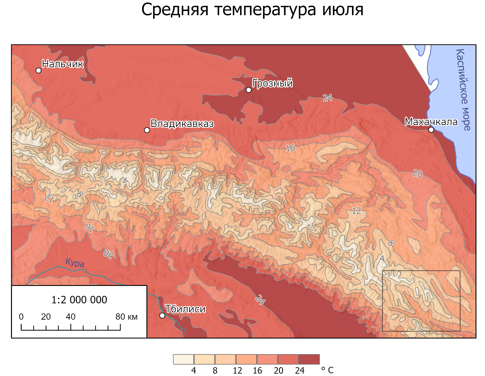{style="height:30vh; object-fit:contain;"}

:::

::: {.column width="50%"}

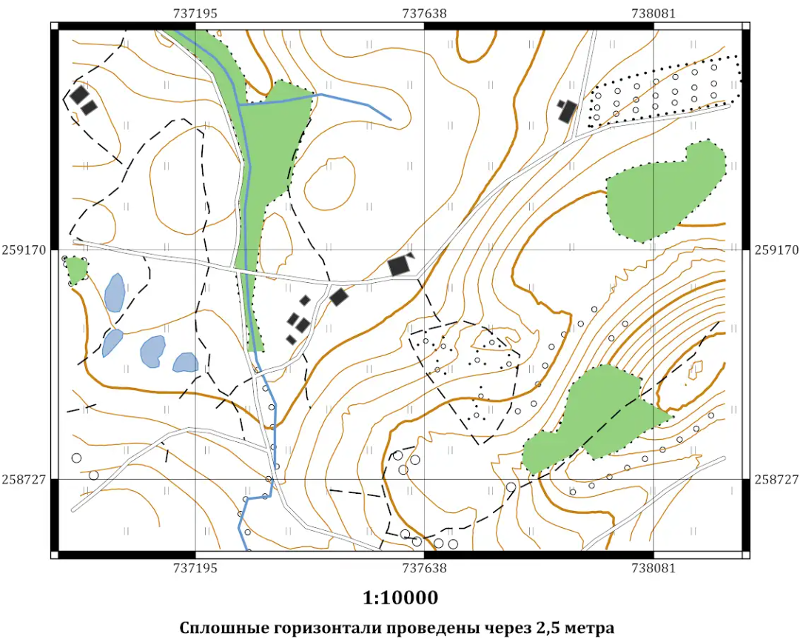{style="height:30vh; object-fit:contain;"}

:::

::::

---

## Модели пространственных данных

:::: {.columns}

::: {.column width="30%"}

- Векторная модель
  - Точки
  - Линии
  - Полигоны
  - Мульти...
- Растровая модель (модель покрытия)
- Сетевая модель

:::

::: {.column width="70%"}

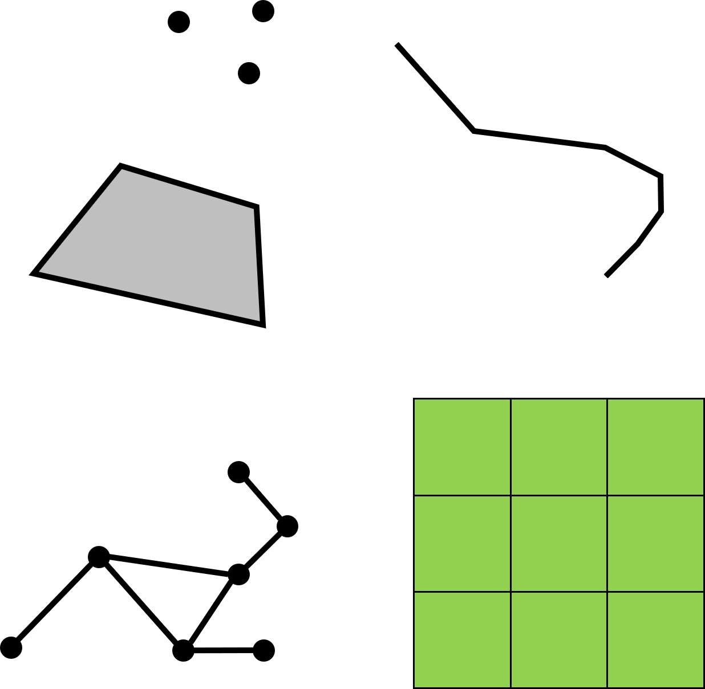{style="height:45vh; object-fit:contain;"}

:::

::::

---

## Координатные системы отсчёта пространственных данных

- Геометрия объектов описывается через пары или тройки координат
- Для классов объектов должна быть корректно указана КСО
- КСО слоёв и КСО всей карты могут не совпадать – они перепроецируются на лету.

Координатные системы отсчёта бывают:

- Географические
- Прямоугольные

::: {.callout-tip}
## Не путайте термины!

В геоинформатике принято различать понятия «координатная система отсчёта» (Spatial Reference System) и «система координат» (Coordinate System).

СК – это абстрактная математическая конструкция, которая определяет способ задания координат в пространстве

КСО – это конкретная реализация СК, которая включает в себя параметры проекции, эллипсоида и другие характеристики.

:::

---

## Базы пространственных данных (1)

**База данных** – это организованная совокупность данных, которая позволяет эффективно хранить, управлять и извлекать информацию

**База пространственных данных** – совокупность пространственных данных, организованных по определённым правилам, устанавливающим общие принципы описания, хранения и манипулирования данными, предназначенная для удовлетворения информационных потребностей пользователя [ГОСТ Р 52438-2005 2018]

Как правило, БД состоит из **таблиц**, которые могут быть связаны между собой через общие поля (ключи)

У каждой таблицы есть уникальное имя, а у каждого объекта в таблице есть **уникальный идентификатор (ID)**, который позволяет однозначно идентифицировать его

Важной частью БД является **система управления базами данных (СУБД)**, которая обеспечивает интерфейс для взаимодействия с данными, а также поддерживает целостность и безопасность данных

---

## Базы пространственных данных (2)

:::: {.columns}

::: {.column width="60%}

В одной таблице БПД, как правило, используется **один** тип геометрии

Тип геометрии зависит от масштаба и сущности, которую описывает таблица

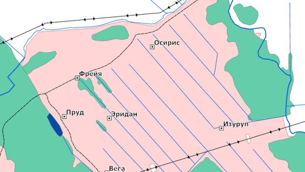{style="height:40vh; object-fit:contain;"}

:::

::: {.column width="40%}

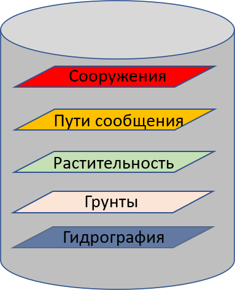{style="height:50vh; object-fit:contain;"}

:::

::::

---

## Форматы векторных данных

:::: {.columns}

::: {.column width="70%"}

- База данных Geopackage (*.gpkg)
- База данных ESRI (*.gdb)
- Шейп-файл ESRI (*.shp)
- Таблица MapInfo (*.tab)
- Keyhole Markup language (*.kml, *.kmz)
- Garmin GPX (*.gpx)
- …

:::

::: {.column width="30%"}

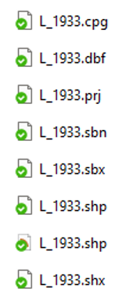{style="height:40vh; object-fit:contain;"}

:::

::::

---

## Форматы растровых данных

- GeoTIFF (*.tif)
- PNG (*.png)
- JPG (*.jpg)
- …

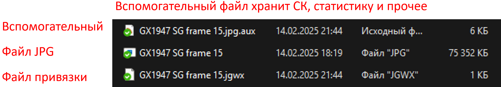{style="height:25vh; object-fit:contain;"}

---

## Привязка и трансформация растровых данных

**Географическая привязка** изображения – сопоставление точек изображения и точек местности в какой-либо системе координат

**Трансформация** изображения – преобразование изображения в заданную систему координат, отнесённую к земной поверхности (как правило, спроецированную)

**Опорные точки** – хорошо и однозначно распознаваемые объекты на изображении, для которых известны координаты

**Наземные опорные точки** – объекты, координаты которых определены с помощью наземных измерений (например, ГНСС)

---

## Типы трансформации (1)

:::: {.columns}

::: {.column width="40%}

Разные типы трансформации требуют разное количество опорных точек и по-разному преобразуют изображение

- **Линейная** (3+ точки)
- Проективная (4+ точки)
- Нелинейная (6+ точек)

:::

::: {.column width="60%}

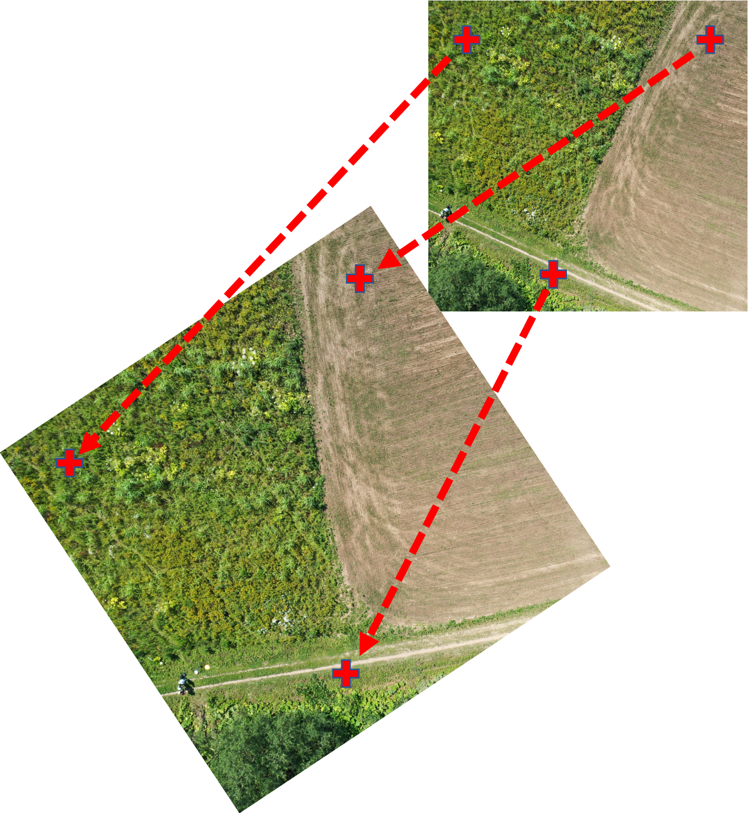{style="height:50vh; object-fit:contain;"}

:::

::::

---

## Типы трансформации (2)

:::: {.columns}

::: {.column width="40%}

Разные типы трансформации требуют разное количество опорных точек и по-разному преобразуют изображение

- Линейная (3+ точки)
- **Проективная** (4+ точки)
- Нелинейная (6+ точек)

:::

::: {.column width="60%}

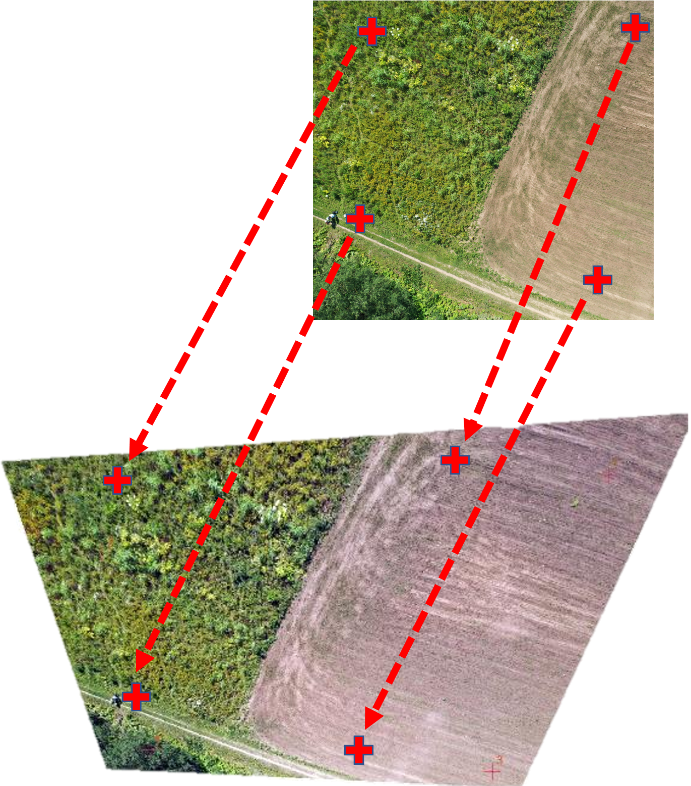{style="height:50vh; object-fit:contain;"}

:::

::::

---

## Типы трансформации (3)

:::: {.columns}

::: {.column width="40%}

Разные типы трансформации требуют разное количество опорных точек и по-разному преобразуют изображение

- Линейная (3+ точки)
- Проективная (4+ точки)
- **Нелинейная** (6+ точек)

:::

::: {.column width="60%}

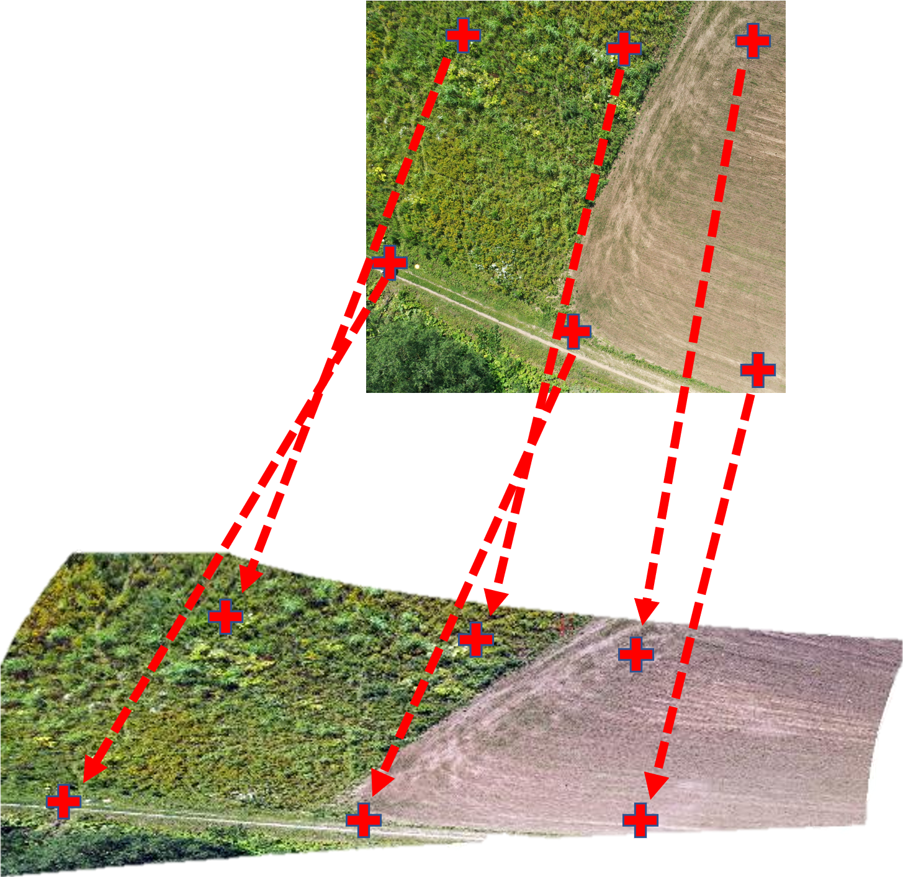{style="height:50vh; object-fit:contain;"}

:::

::::

---

## Атрибуты векторных данных

Векторные объекты состоят из:

- Геометрии (позиционная составляющая)
- Семантики (атрибутивная составляющая)

**Атрибут** – свойство объекта в формализованном виде (столбец таблицы)

:::: {.columns}

::: {.column width="50%"}

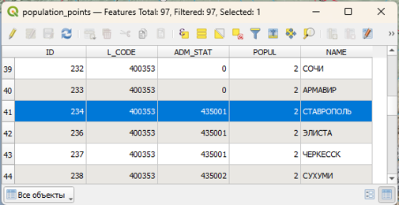{style="height:25vh; object-fit:contain;"}

:::

::: {.column width="50%"}

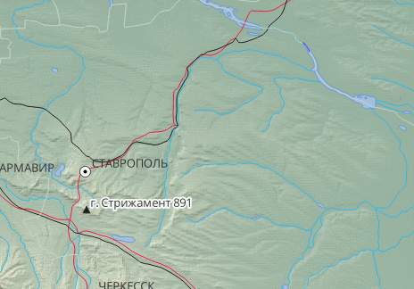{style="height:25vh; object-fit:contain;"}

:::

::::

---

## Тип поля

:::: {.columns}

::: {.column width="50%"}

- Текстовые (string)
- Числовые
  - Целочисленные короткие (short integer)
  - Целочисленные длинные (long integer)
  - С плавающей точкой (float/real)
- Дата-время
- Логические
- …

:::

::: {.column width="50%}

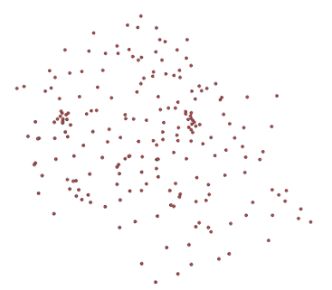{style="height:20vh; object-fit:contain;"}

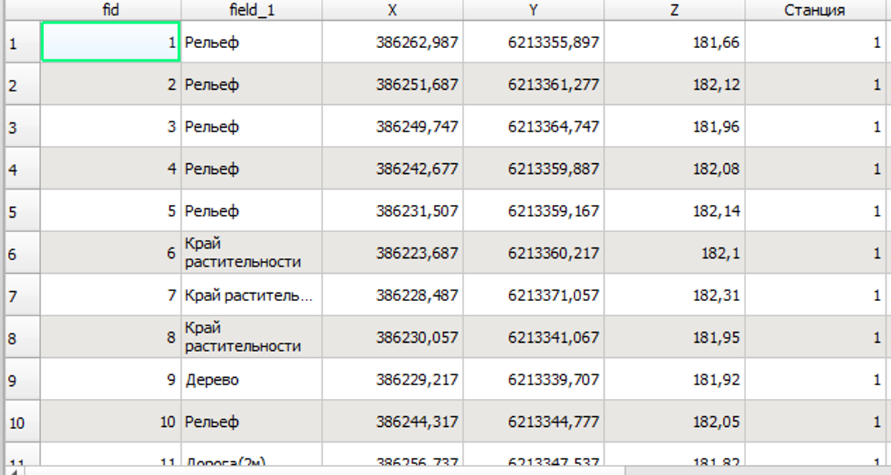{style="height:25vh; object-fit:contain;"}

:::

::::

---

## Векторизация

:::: {.columns}

::: {.column width="40%"}

Любой линейный или площадной объект может быть векторизован ломаной линией с соответствующей детализацией

:::

::: {.column width="60%}

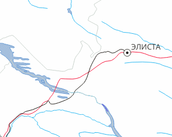{style="height:50vh; object-fit:contain;"}

:::

::::

---

## Топология

:::: {.columns}

::: {.column width="50%"}

Топология – правила взаимного расположения объектов в пространстве, например:

- имеет общую границу
- находится внутри ...
- не пересекается с ...
- пересекается с ...

При векторизации необходимо соблюдать топологию смежных объектов

:::

::: {.column width="50%}

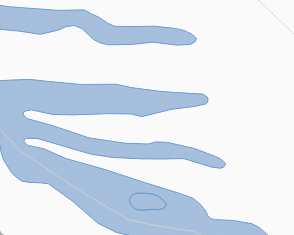{style="height:40vh; object-fit:contain;"}

:::

::::

---

## Чтение текстовых данных (1)

:::: {.colomns}

::: {.column width="50%"}

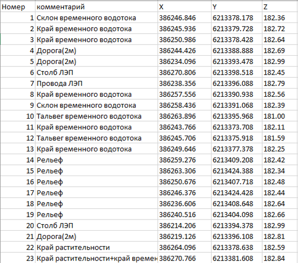{style="height:40vh; object-fit:contain;"}

:::

::: {.column width="50%"}

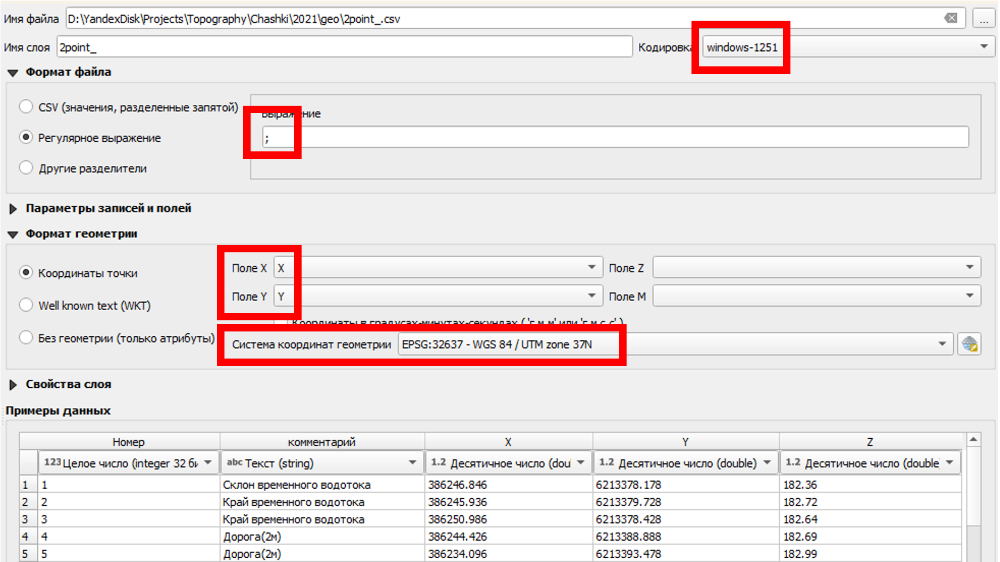{style="height:40vh; object-fit:contain;"}

:::

::::

---

## Чтение текстовых данных (2)

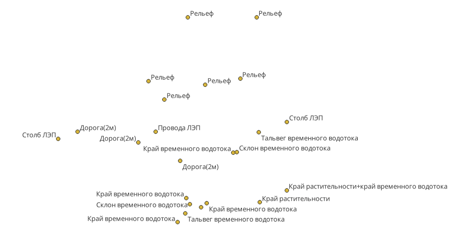{style="height:40vh; object-fit:contain;"}

---

## Интерполяция точечных данных

Интерполяция – это процесс оценки значений функции в точках, для которых нет данных, на основе известных значений в других точках

:::: {.colomns}

::: {.column width="50%"}

Линейная интерполяция (триангуляция Делоне)

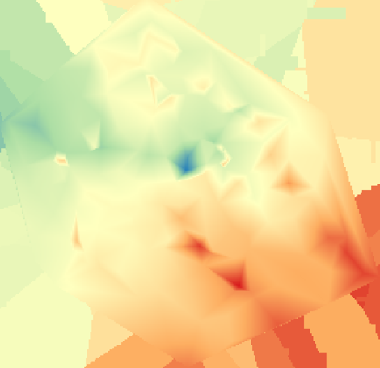{style="height:40vh; object-fit:contain;"}

:::

::: {.column width="50%"}

Интерполяция методом обратно-взвешенных расстояний

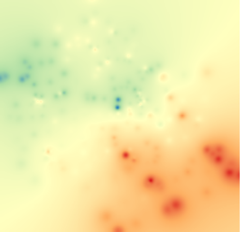{style="height:40vh; object-fit:contain;"}

:::

::::

---

## Цифровые модели рельефа и поверхности

**ЦМР** (*Digital elevation model – DEM*) – покрытие, функция которого возвращает параметры рельефа земной поверхности, включая высоту (цифровая модель высот) [Самсонов, 2026]

**ЦМП** (*Digital surface model – DSM*) – поле высот, соответствующее совокупности открытых поверхностей рельефа и объектов местности [Guth et al., 2021]

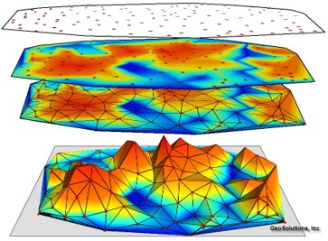{style="height:30vh; object-fit:contain;"}

---

## Символика векторных объектов

:::: {.columns}

::: {.column width="20%}

- Стиль слоя связан со значениями атрибутов объектов
- Каждый символ в используемом стиле может быть представлен в виде многослойного конструктора
- Стиль слоя не хранится в векторных слоях БД или шейп-файлов – его нужно сохранять отдельно, если планируется открывать данные с тем же стилем в другом проекте
- Подписи объектов так же связаны со значением атрибутов объектов

:::

::: {.column width="80%}

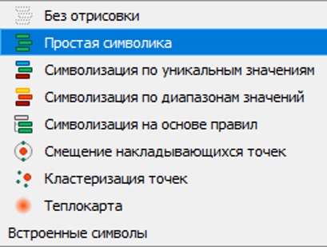{style="height:50vh; object-fit:contain;"}

:::

::::

---

## Слои символа

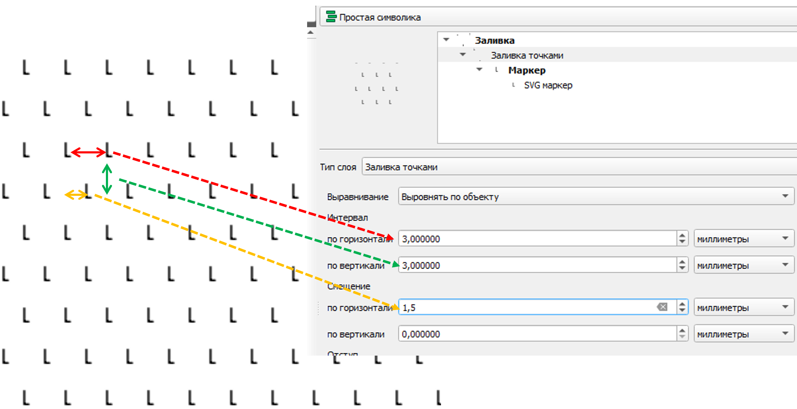{style="height:50vh; object-fit:contain;"}

---

## Векторные преобразования

:::: {.columns}

::: {.column width="20%}

- Преобразование точек в линию
- Преобразование линий в полигоны
- Преобразование объектов в точку (центроид)

:::

::: {.column width="80%}

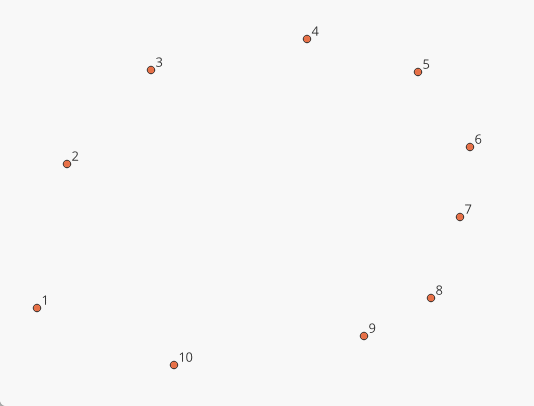{style="height:50vh; object-fit:contain;"}

:::

::::

---

## Построение буферных зон

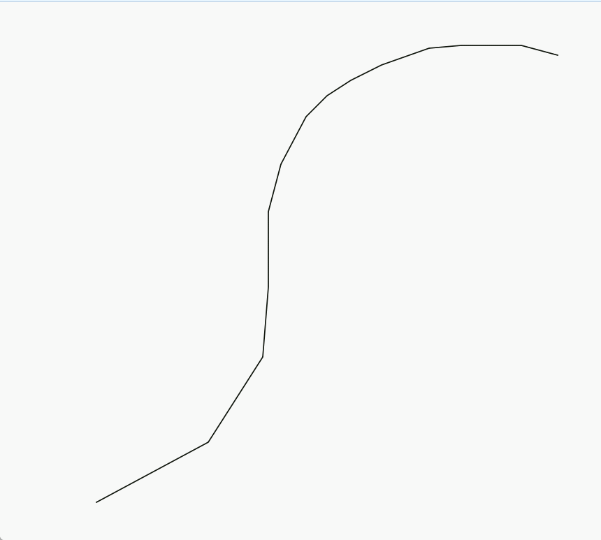{style="height:50vh; object-fit:contain;"}

---

## Редактирование векторных объектов

:::: {.columns}

::: {.column width="50%}

- Вырезание
- Соединение
- Разрезание

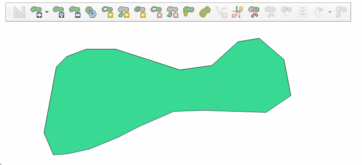{style="height:30vh; object-fit:contain;"}

:::

::: {.column width="50%}

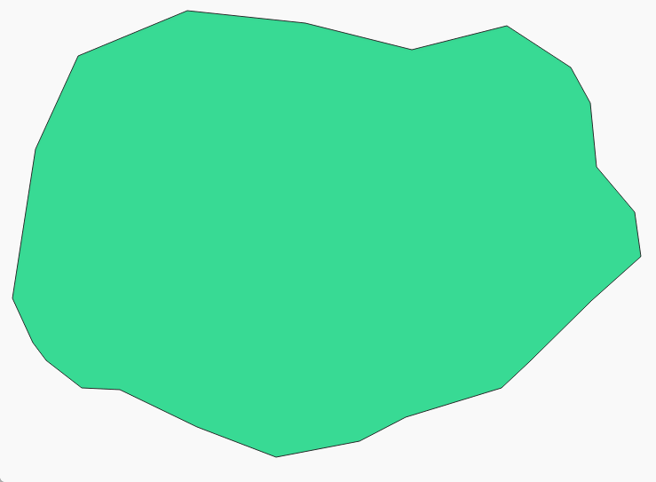{style="height:30vh; object-fit:contain;"}

:::

::::

---

## Операции с растром

:::: {.columns}

::: {.column width="20%}

- Алгебра карт
- Построение карт углов наклона по ЦМР/ЦМП
- Фильтрация
- Построение поверхности расстояний
- ...

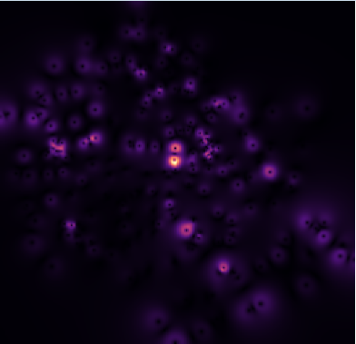{style="height:30vh; object-fit:contain;"}

:::

::: {.column width="80%}

{style="height:30vh; object-fit:contain;"}

:::

::::

---

## Геоинформационное программное обеспечение

- Назначение
  - Общего назначения (QGIS, ArcGIS, MapInfo, Аксиома)
  - Специализированное (SAGA)
- Лицензирование
  - С открытым кодом – бесплатные (QGIS, SAGA, GRASS)
  - Проприетарные – платные (ArcGIS, MapInfo)
- Установка и использование
  - Настольные (ArcGIS, QGIS)
  - Веб-приложения (ArcGIS Online, Google Earth Engine)
  - Мобильные приложения (Qfield)

---

## Организация работы в ПО

При работе с настольными ГИС-пакетами у вас, как правило, есть файл проекта и файлы данных. Теоретически они могут быть в разных директориях, но лучше чтобы были в одной

Директория с данными и проектами должна храниться на диске (не на рабочем столе/загрузках и т.д.)

Путь к файлам, названия файлов должны быть на латинице, без пробелов и спецсимволов

Сохранение проекта и сохранение данных – это не одно и то же

---

## Сюрприз № 6

<https://forms.gle/3zE7aKQt7Nfpu9N18>

{style="height:55vh; object-fit:contain;"}